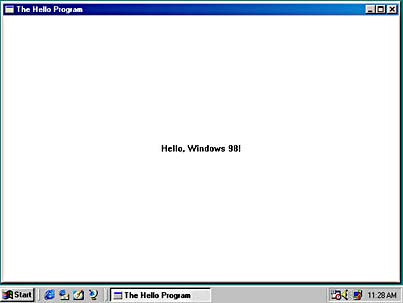

# 第 5 章 窗口与消息

在前面俩章的范例程序中，我们通过 `MessageBox` 函数来将文本输出传给用户。`MessageBox` 函数创建了一个「窗口」。在 Windows 中，「窗口」（window）这个词具有明确的含义。窗口是位于屏幕中的一个矩形区域，它用于接收用户的输入，然后以文本或图形的形式显示输出。  

`MessageBox` 函数虽然可以创建窗口，但它所创建的窗口具有特殊的用途，因此其灵活性有限。消息框窗口带有一个标题栏（有一个关闭按钮）、一个可选图标、一行或多行文字，以及至多四个按钮。但这里的图标和按钮只能从 Windows 提供的一个非常有限的集合中择。   

`MessageBox` 函数固然十分有用，但我并不打算对它展开进一步讨论。因为我们不可能通过消息框来显示图形，而且我们也无法做到为消息框添加菜单。因此我们很有必要创建自己的窗口，而现在正是时候。  

## 5.1 窗口的创建

窗口的创建非常容易，只需调用 `CreateWindow` 函数即可。  

其实，窗口的创建过程并非真的如此简单。虽然用千创建窗口的函数的确是 `CreateWindow`，而且能从 /Platform SDK/User Interface Services/Windowing/Windows/Window Reference/Window Functions [^1]找到该函数的文档，但你还是会发现一些概念不易理解，如 `CreateWindow` 函数的第一个参数称为「窗口类名称」，而窗口类又与一个称为「窗口过程」的东西关联在一起。因此在我们试图调用 `CreateWindow` 函数之前，很有必要简要交代一些背景知识。

[^1]: 译注： /msdn Library/Win32 and COM Development/User Interface/Windows User Interface/Windowing/Windows/Windows

### 5.1.1 系统结构概述

进行 Windows 程序设计时，其实就是在进行一种面向对象的编程。在 Windows 环境下，有一种对象我们接触最频繁，正是它赋予了 Windows 这个名称，它所具有的灵性你很快就会有深切的感受，它甚至可能让你魂牵梦萦。这个对象正是窗口（window）。  

装饰桌面最明显的窗口莫过于应用程序窗口。这些窗口包含一个显示有程序名称的标题栏、一个菜单栏。可能还带一个工具栏（toolbar）和一个滚动条（scrollbar）。另外一种类型的窗口是对话框，这种窗口可以不带标题栏。

没有那么明显的还包括各种各样的按钮（push button） 、单选按钮（radio button）、复选框（checkbox）、列表框（listbox）、滚动条（scroll bar）、文本框等，这些对象都可用于装饰对话框。每一个这些对象都是一个窗口。更准确地说，这些对象都被称为「子窗口」或「控件窗口」或「子窗口控件」。  

在用户眼中，这些窗口是屏幕上的对象，并可借助键盘或鼠标直接与之进行交互。非常有趣的是，程序员的视角与用户的视角非常一致。用户对窗口的输入以「消息」的形式传递给窗口，而窗口也借助消息来与其他窗口进行通信。深入理解「消息」这个概念是学习 Windows 编程过程中的一个重要环节。  

下面给出 Windows 消息的一个例子。众所周知，大多数 Windows 程序的窗口尺寸都是可以调整的，即用户可用鼠标抓取窗口的边框，并通过拖动操作改变窗口的尺寸。通常程序都会通过改变窗口的内容来对这种改变做出响应。你可能已经猜测到（你很可能是正确的），在用户调整窗口尺寸的过程中所产生的所有琐碎的代码都是由 Windows 而非应用程序进行处理的。但是应用程序显然「知道」该窗口尺寸已发生变化，因为它能够对自身的显示格式加以改变。   

但是应用程序是如何获知用户对窗口尺寸己做调整的呢？对习惯于传统字符模式编程的程序员来说，操作系统不具备将这类消息传递给用户的机制。因此这个问题是理解 Windows 体系结构的关键。当用户改变窗口的尺寸时，Windows 便向应用程序发送一条携带新窗口尺寸相关信息的消息，接着应用程序对自身的内容进行调整以反映出窗口尺寸的变化。  

「Windows 向应用程序发送了一条消息。」我希望你能反复品味这句话。它到底有什么含义？这里，我们正在讨论的是程序代码而非电报系统。那么操作系统是如何将消息传递给应用程序的？  

当我提到「Windows 向应用程序发送了一条消息。」这句话时，我其实是在说 Windows 调用了该程序内部的一个函数——这个函数是你写的，而且是该程序的核心。此函数的参数描述了由 Windows 所发送并由你的程序所接收的特定消息。这个函数被称为「窗口过程」。  

对于应用程序调用操作系统功能的这种想法想必你一定不陌生，比如程序打开一个磁盘文件就是这样做的。而对操作系统调用应用程序这个想法你可能会略感不适，但这种思路的确正是 Windows 体系结构的基础。  

应用程序所创建的每一个窗口都有一个与之相关联的窗口过程。这个窗口过程可以是应用程序中的某一个函数，也可以位于一个动态链接库中。Windows 正是通过调用该窗口过程来向窗口传递消息的。窗口过程则依据这些消息做出相应的处理，然后将控制权返还给 Windows 。  

更准确地说，窗口总是依据「窗口类」来创建的。窗口类标识了用于处理传递给窗口的消息的窗口过程。窗口类的使用允许多个窗口共享同一窗口类，因而多个窗口可以使用相同的窗口过程。例如，Windows 程序中的所有按钮都基于相同的窗口类，与该窗口类关联的窗口过程位于一个 Windows 动态链接库中，它可对所有传递到按钮窗口的消息进行处理。  

在面向对象编程中，对象是代码和数据的组合。一个窗口也是一个对象。其代码对应窗口过程。数据则对应窗口过程所保留的信息以及 Windows 为每个窗口和存在于系统中的窗口类所保留的信息。  

窗口过程用于处理传递给窗口的消息。通常这些消息用于将用户的鼠标或键盘输入通知给窗口。例如，正是通过这种途径按钮窗口能够获知它被「单击」。而当窗口尺寸被调整或当窗口表面需要重绘时，也有相应的消息来通知窗口。  

当 Windows 程序开始执行时，Windows 首先为该程序创建一个「消息队列」（message queue）。该消息队列中存放着应用程序可能创建的所有窗口的消息。Windows 应用程序中一般都包含一小段称为「消息循环」（message loop）的代码，该段代码用于从消息队列中检索消息，并将其分发给相应的窗口过程。其他消息则不经过消息队列直接发送给窗口过程。  

如果对上述 Windows 体系结构的过于抽象的描述仍然感到不解，不妨来看一个例子，以便更好地体会如何将窗口、窗口类、窗口过程、消息队列、消息循环以及窗口消息这些元素整合到实际的应用程序中。  

### 5.1.2 HELLOWIN 程序

要创建窗口，首先需要注册一个窗口类，而窗口类又需要窗口过程来处理窗口消息。这些是几乎所有 Windows 程序都会包括的一些常规而繁琐的步骤。图 3 -1 所示的 HELLOWIN 程序展示了 Windows 程序的一般结构。

```c
/*------------------------------------------------------------
HELLOWIN.C -- Displays "Hello, Windows 98!" in client area
				(c) Charles Petzold, 1998
------------------------------------------------------------*/
#include <windows.h>

LRESULT CALLBACK WndProc(HWND, UINT, WPARAM, LPARAM);

int WINAPI WinMain(HINSTANCE hInstance, HINSTANCE hPrevInstance,
					PSTR szCmdLine, int iCmdShow)
{
    static TCHAR szAppName[] = TEXT("HelloWin");
    HWND hwnd;
    MSG msg;
    WNDCLASS wndclass;

    wndclass.style = CS_HREDRAW | CS_VREDRAW;
    wndclass.lpfnWndProc = WndProc;
    wndclass.cbClsExtra = 0;
    wndclass.cbWndExtra = 0;
    wndclass.hInstance = hInstance;
    wndclass.hIcon = LoadIcon(NULL, IDI_APPLICATION);
    wndclass.hCursor = LoadCursor (NULL, IDC_ARROW); 
    wndclass.hbrBackground = (HBRUSH)GetStockObject(WHITE_BRUSH);
    wndclass.lpszMenuName = NULL;
    wndclass.lpszClassName = szAppName;
    
    if (!RegisterClass(&wndclass))
    {
        MessageBox(NULL, TEXT("This program requires Windows NT!"),
        szAppName, MB_ICONERROR);
        return 0;
    }
    hwnd = CreateWindow (szAppName, // window class name
    	TEXT ("The Hello Program"), // window caption
	    WS_OVERLAPPEDWINDOW, 		// window style
    	CW_USEDEFAULT, 				// initial x position
    	CW_USEDEFAULT, 				// initial y position
	    CW_USEDEFAULT, 				// initial x size
    	CW_USEDEFAULT, 				// initial y size
	    NULL, 						// parent window handle
    	NULL, 						// window menu handle
	    hInstance, 					// program instance handle
    	NULL); 						// creation parameters
    
	ShowWindow(hwnd, iCmdShow);
	UpdateWindow(hwnd);
    
    while (GetMessage(&msg, NULL, 0, 0))
    {
        TranslateMessage(&msg);
        DispatchMessage(&msg);
    }
	return msg.wParam;
}

LRESULT CALLBACK WndProc (HWND hwnd, UINT message, 
                          WPARAM wParam, LPARAM lParam)
{
    HDC hdc;
    PAINTSTRUCT ps;
    RECT rect;
    
    switch (message)
    {
        case WM_CREATE:
        	PlaySound(TEXT("hellowin.wav"), NULL, SND_FILENAME | SND_ASYNC);
        	return 0;
        case WM_PAINT:
        	hdc = BeginPaint(hwnd, &ps);
            GetClientRect(hwnd, &rect);
            DrawText (hdc, TEXT ("Hello, Windows 98!"), -1, &rect,
            	DT_SINGLELINE | DT_CENTER | DT_VCENTER);
            EndPaint(hwnd, &ps);
        	return 0;
        case WM_DESTROY:
        	PostQuitMessage(0);
	        return 0;
    }
    return DefWindowProc(hwnd, message, wParam, lParam);
}
```

<div align=center>图3-1 HELLOWIN 程序</div>

前面这段程序创建了一个普通的应用程序窗口，如图 3-2 所示。`Hello, Windows 98 !"` 显示于窗口的中心。如果计算机中安装有声卡，还会听到我读出的声音。    



<div align=center>图3-2 HELLOWIN 窗口 </div>

这里有几点需要注意：如果使用 Visual C++ 为此程序创建了一个新的项目（project），则需要为连接器添加一个对象库。方法如下，从 Project 菜单中选择 Settings 菜单项，然后选择 Link 选项卡。从 Category 列表框中选择 General，并添加 WINMM.LIB 到 Object/Library Modules 文本框。我们这样做的原因是 HELLOWIN 程序调用了一个多媒体函数，而多媒体对象库并未包含在默认项目内。如果不添加该库，你将从链接器那里得到一条错误提示，指出无法对 `PlaySound` 函数进行解析。  

HELLOWIN 读取一个名为 HELLOWIN.WAV 的文件，该文件位于本书配套光盘的 HELLOWIN 目录中。在执行 HELLOWIN.EXE 时，默认路径必须为 HELLOWIN。在 Visual C++ 内直接运行程序时情形也如此，无论可执行程序是位于 HELLOWIN 的 RELEASE 子目录下还是 DEBUG 子目录下。  

### 5.1.3 通盘考虑

实际上，任何 Windows 程序的结构都与 HELLOWIN.C 大体类似。没有人会真正记住这种框架的所有细节。通常，Windows 程序员都是将已有的程序代码复制到新程序中，然后加以修改。你可以按照这种方式自由使用配套光盘中的代码。  

前面提到 HELLOWIN 在窗口中心显示了一个文本字符串。实际上，这样的表述不够准确。这行文本实际上是显示在该程序的「客户区」（client area）的中心，客户区对应图 3-2 中标题栏和窗口边框之间的白色区域。这种区分对我们非常重要；因为客户区是一块应用程序可以自由绘图并向用户传达可视输出的区域。  

你可能会惊讶于前面这段程序仅用 80 行代码即完成了诸多功能。你可用鼠标按住标题栏在屏幕上来回拖动，你可以用鼠标对窗口尺寸进行调整。当窗口尺寸发生改变时，程序会自动将文本字符串调整到客户区的中心。你可单击最大化按钮使 HELLOWIN 窗口充满整个屏幕。你可单击最小化按钮将窗口从屏幕上缩隐。你也可通过系统菜单（位于标题栏最左端的小图标）来调用这些选项。你还可从系统菜单中选择 Close 选项或单击标题栏最右端的关闭按钮或双击系统菜单图标来关闭窗口，从而结束程序。  

在本章的其余部分，我们将对前述程序的所有细节一一展开讨论。但首先，让我们从全局着眼考虑一下这段程序。  

HELLOWIN.C 中有一个 `WinMain` 函数（此函数在前两章的示例程序中我们已经接触过），此外还有另外一个名为`WndProc` 的函数。该函数正是窗口过程。（在 Windows 程序员的交流用语中，该函数被称为「win prock」。)请注意，在HELLOWIN.C 中，并未出现任何调用 `WndProc` 的代码。但在 `WinMain` 中，有一个对 `WndProc` 的引用，这也正是该函数在这段程序非常靠前位置声明的原因。  

**Windows 函数调用**  


HELLOWIN 调用了至少 18 个 Windows 函数。下面按照出现顺序一一列出这些被调用的函数（并附有简短描述）:  

- `LoadIcon` 加载图标，以供程序使用。
- `LoadCursor` 加载鼠标光标，以供程序使用。
- `GetStockObject` 获取一个图形对象。在本例中是一个用来对窗口的背景进行重绘的画刷。
- `RegisterClass` 为应用程序的窗口注册一个窗口类。
- `MessageBox` 显示消息框。
- `CreateWindow` 基于窗口类创建一个窗口。
- `ShowWindow` 在屏幕中显示窗口。
- `UpdateWindow` 指示窗口对其自身进行重绘。
- `GetMessage` 从消息队列获取消息。
- `TranslateMessage` 翻译一些键盘消息。
- `DispatchMessage` 将消息发送给窗口过程。
- `PlaySound` 播放声音文件。
- `BeginPaint` 标明窗口绘制开始。
- `GetClientRect` 获取窗口客户区的尺寸。
- `DrawText` 显示一个文本字符串。
- `EndPaint` 结束窗口绘制。
- `PostQuitMessage` 将「退出」消息插入消息队列。
- `DefWindowProc` 执行默认的消息处理。  

这些函数在 Platform SDK 文档中都有详细说明，它们的声明位于各种头文件中，其中大部分都位于 WINUSER.H 中。  

**大写标识符**

你可能已经注意到了 HELLOWIN.C 中所使用的大量大写标识符。这些标识符都是在 Windows 头文件中定义的。这些标识符有很多都是以两个或三个字母作为前缀，且其后紧跟一个下划线：  

CS_HREDRAW             DT_VCENTER             SND_FILENAMW
CS_VREDRAW              IDC_ARROW              WM_CREATE
CW_USEDEFAULT       IDI_APPLICATION    WM_DESTROY
DT_CENTER                 MB_ICONERROR       WM_PAINT
DT_SINGLELINE          SND_ASYNC              WS_OVERLAPPEDWINDOW			

 这些标识符其实都是数值常量。前缀表明该常量所属的一般类别，如下表所示。  

| 前缀 |     含义     |
| :--: | :----------: |
|  CS  |  类风格选项  |
|  CW  | 创建窗口选项 |
|  DT  | 文本绘制选项 |
| IDI  | 图标的 ID 号 |
| IDC  | 光标的 ID 号 |
|  MB  |  消息框选项  |
| SND  |   声音选项   |
|  WM  |   窗口消息   |
|  WS  |   窗口消息   |

在进行 Windows 编程时，这些数值常量是没有必要强记下来的。实际上，每个数值常量在头文件中都定义有一个标识符。  

**新数据类型**

在 HELLOWIN.C 中使用的一些其他标识符属于新数据类型，这些类型也是在 Windows 头文件中通过 `typedef` 或`＃define` 语句定义的。这样做的动机在于减轻 Windows 程序从 16 位系统移植到 32 位系统的工作量。如今看来，实际效果与期望还是存在一定的距离，不过这种思想还是很值得推荐的。  

有时，这些新数据类型纯粹是出于简便的考虑而作的缩写。例如，`WndProc` 的第二个参数为 `UINT` 类型，这种类型其实就是 `unsigned int`，在 Windows 98 中，这种类型表示一个 32 位的值。`WinMain` 的第三个参数类型为 `PSTR`，该类型表示一个指向非宽字符串的指针，即 char*。  

其余类型就不那么显而易见了。例如，`WndProc` 的第三个和第四个参数的类型分别为 `WPARAM` 和 `LPARAM`。这些名称的起源还有一段「典故」。当 Windows 还是 16 位系统时，`WndProc` 的第三个参数类型被定义为 `WORD`，表示一个 16  位的无符号短整型，而第四个参数类型被定义为 `LONG`，表示一个 32 位的有符号长整型， `PARAM` 的前缀 W 和 L 正是由此而来。但在 32 位版本的 Windows 中，`WPARAM` 被定义为 `UINT`，而 `LPARAM` 被定义为 `LONG`（仍然为 C 语言的 `long` 数据类型），因此窗口过程的这两个参数都是 32  位的。这就有些令人疑惑，因为 `WORD` 类型在 Windows 98 中仍然被定义为 16 位无符号短整型，因此 `PARAM` 的前缀 W 有些取名不当。  

`WndProc` 函数的返回值类型为 `LRESULT`。该类型等价于 `LONG`。`WinMain` 函数的类型为 `WINAPI`（与在头文件中定义的每一个 Windows 函数调用相同），而 `WndProc` 函数的类型为 `CALLBACK`。这两个标识符都被定义为 `＿stdcall`，它指定了在 Windows 和应用程序之间函数调用的特定次序。  

HELLOWIN 程序还使用了四种数据结构（本章稍后将对其进行讨论），这四种结构也是在 Windows 头文件中定义的。这些数据结构如下表所示。  

|    结构     |    含义    |
| :---------: | :--------: |
|     MSG     |  消息结构  |
|  WNDCLASS   | 窗口类结构 |
| PAINTSTRUCT |  绘制结构  |
|    RECT     |  矩形结构  |

`WinMain` 中使用前两种数据结构定义了名称为 `msg` 和 `wndclass` 的两个结构。后两种数据结构被用于在 `WndProc` 中定义两个名称分别为 `ps` 和 `rect` 的结构。  

**理解句柄**

对于各种类型的句柄，有下表所示的三种大写标识符。  

|  标识符   |        含义        |
| :-------: | :----------------: |
| HINSTANCE | 实例句柄——程序本身 |
|   HWND    |      窗口句柄      |
|    HDC    |    设备环境句柄    |

在 Windows 中，句柄的使用非常频繁。在本章结束之前，你还将会碰到 `HICON`（图标的句柄）、`HCURSOR`（鼠标指针的句柄）以及 `HBRUSH`（图形画刷的句柄）。  

句柄本质上是引用某个对象的数值（通常为 32 位）。Windows 中的句柄非常类似于传统的 C 或 MS-DOS 程序中使用的文件句柄。一般情况下，应用程序几乎总是通过调用 Windows 函数来获取句柄。应用程序通过在其他 Windows 函数中使用句柄来引用相应对象。句柄的实际取值对你的程序来说并不重要，而将句柄传递给你的程序的 Windows 模块则知道如何通过句柄来引用对象。  

**匈牙利标记法**

你可能注意到了， HELLOWIN.C 中一些变量名的风格十分独特。其中一个例子是 `szCmdLine`，它作为参数传入 `WinMain` 函数。  

许多 Windows 程序员都使用「匈牙利标记法」作为变量命名约定。这是为了纪念具有传奇色彩的微软程序员 Charles Simonyi。这种标记法非常简单，即变量名以表明该变量数据类型的小写字母开始。例如，`szCmdLine` 的前缀 sz 表示「以零结束的字符串」`hlnstance` 和 `hPrevInstance` 中的前缀 h 表示「句柄」；`iCmdShow` 中的前缀 i 表示「整型」。`WndProc` 的后两个参数也使用了匈牙利标记法。我在前面虽然提过，`wParam` 取名为 `uiParam`（ui 表示 `unsigned int`）也许更合适，但由于这两个参数是使用数据类型 `WPARAM` 和 `LPARAM` 定义的，因此我保留了这些参数的传统名称。  

当命名结构变量时，可使用结构名（或结构名称的缩写）的小写形式作为变量名称的前缀或整个变量名。例如，在 HELLOWIN.C 的 `WinMain` 函数中，`msg` 变量是一个 `MSG` 类型的结构，`wndclass` 是一个`WNDCLASS` 类型的结构。在`WndProc` 函数中，`ps` 是一个 `PAINTSTRUCT` 结构，而 `rect` 是一个 `RECT` 结构。  

匈牙利标记法可帮助你远离一些错误（bug）。由于变量的名称描述了该变量的用法及其数据类型，你在编程时就不大可能犯数据类型不匹配的错误。  

本书使用的变量名前缀如下表所示。  

|  前缀  |                    数据类型                    |
| :----: | :--------------------------------------------: |
|   c    |             char 或 WCHAR 或 TCHAR             |
|   by   |               BYTE（无符号字符）               |
|   n    |                short（短整型）                 |
|   i    |                  int（整型）                   |
|  x, y  |           int，表示 x 坐标和 y 坐标            |
| cx, cy | int， 表示 x 或 y 的长度，c 表示 count（计数） |
| B 或 f |             BOOL(int)；f 表示 flag             |
|   w    |              WORD（无符号短整型）              |
|   l    |                 LONG（长整型）                 |
|   dw   |             DWORD（无符号长整型）              |
|   fn   |                      函数                      |
|   s    |                     字符串                     |
|   sz   |                以零结束的字符串                |
|   h    |                      句柄                      |
|   p    |                      指针                      |

### 5.1.4 窗口类的注册

窗口总是基于窗口类来创建的。窗口类确定了处理窗口消息的窗口过程。  

多个窗口可以同时基于某一窗口类来创建。例如，所有的按钮窗口一包括下压按钮、复选框和单选按钮一都是基于同一个窗口类来创建的。窗口类为所有这些窗口定义了窗口过程和一些其他的特性。当创建一个窗口时，我们往往还需要定义一些该窗口特有的附加特性。  

在创建应用程序窗口之前，必须调用函数 `RegisterClass` 来注册窗口类。该函数只需要一个参数，即一个指向 `WNDCLASS` 类型的结构的指针。该结构中包含两个指向字符串的指针（字段），因此，在头文件 WINUSER.H 中，它有两种不同的定义方式。首先是 ASCII 版本的 `WNDCLASSA`：  

```c
typedef struct tagWNDCLASSA
{
    UINT 		style;
    WNDPROC 	lpfnWndProc;
    int 		cbClsExtra;
    int 		cbWndExtra;
    HINSTANCE 	hInstance;
    HICON 		hIcon;
    HCURSOR 	hCursor;
    HBRUSH 		hbrBackground;
    LPCSTR 		lpszMenuName;
    LPCSTR 		lpszClassName;
}
WNDCLASSA, * PWNDCLASSA, NEAR * NPWNDCLASSA, FAR * LPWNDCLASSA;
```

注意其中匈牙利标记法的使用：前缀 lpfn 表示「指向函数的长指针」（long pointer to a function）。前面曾提到，在 Win32 API 中，长指针和短指针没有任何区别；实际上，它们是 16 位 Windows 系统遗留的概念。前缀 cb 代表「字节数」（count of byte），常常用在一个表示字节尺寸的变量名称中。前缀 h 表示一个「句柄」，而前缀 hbr 表示「画刷的句柄」（handle to a brush）。前缀 lpsz 表示 「指向以零结束的字符串的长指针」（long pointer to a string terminated with a zero）。  

该结构的 Unicode 版本定义如下：  

```c
typedef struct tagWNDCLASSW
{
    UINT 		style;
    WNDPROC 	lpfnWndProc;
    int 		cbClsExtra;
    int 		cbWndExtra;
    HINSTANCE 	hInstance;
    HICON 		hIcon;
    HCURSOR 	hCursor;
    HBRUSH 		hbrBackground;
    LPCWSTR 	lpszMenuName;
    LPCWSTR 	lpszClassName;
}
WNDCLASSW, * PWNDCLASSW, NEAR * NPWNDCLASSW, FAR * LPWNDCLASSW;
```

这个版本与该结构的 ASCII 版本相比，唯一的区别在于最后两个字段被定义为指向宽字符的常量字符串，而不是指向 ASCII 字符的常量字符串。  

头文件 WINUSER.H 在定义了 WNDCLASSA 和 WNDCLASSW 结构之后（另外还定义了指向这些结构的指针），又基于 UNICODE 标识符的定义定义了WNDCLASS 结构和指向 WNDCLASS 结构的指针（将一些指针包含进来， 目的是保持向后的兼容性）：  

```c
#ifdef UNICODE
typedef WNDCLASSW WNDCLASS;
typedef PWNDCLASSW PWNDCLASS;
typedef NPWNDCLASSW NPWNDCLASS;
typedef LPWNDCLASSW LPWNDCLASS;
#else
typedef WNDCLASSA WNDCLASS;
typedef PWNDCLASSA PWNDCLASS ;
typedef NPWNDCLASSA NPWNDCLASS;
typedef LPWNDCLASSA LPWNDCLASS;
#endif
```

在本书中，当我介绍后续结构时，将只给出这些结构在功能上等效的定义，例如对 WNDCLASS 来说，其等效定义如下：  

```c
typedef struct
{
    UINT 		style;
    WNDPROC 	lpfnWndProc;
    int 		cbClsExtra;
    int 		cbWndExtra;
    HINSTANCE 	hInstance;
    HICON 		hIcon;
    HCURSOR 	hCursor;
    HBRUSH 		hbrBackground;
    LPCTSTR 	lpszMenuName;
    LPCTSTR 	lpszClassName;
}
WNDCLASS, * PWNDCLASS;
```

同时，我也放宽了各种指针的定义。相信你也绝对不会在代码中乱堆一些以 LP 和 NP 为首的变量类型。  

在 `WinMain` 中，我们通常用如下形式定义一个 `WNDCLASS` 类型的结构：  

```c
WNDCLASS wndclass;
```

然后对该结构的 10 个字段进行初始化，并调用 `RegisterClass` 函数。  

在 `WNDCLASS` 结构中，两个最重要的字段是第二个字段和最后一个字段。第二个字段 `lpfnWndProc` 是用于基于该窗口类的所有窗口的窗口过程的地址。在 HELLOWIN.C 中，该窗口过程就是 `WndProc`。最后一个字段是窗口类的名称，允许用户任意命名。当程序只创建一个窗口时，窗口类的名称通常与程序名相同。  


另外几个字段描述了窗口类的其他一些特性。下面依次考察 `WNDCLASS` 结构的每个字段。  

以下语句利用 C 语言的按位或运算符，组合了两个 32 位「类风格」（class style）的标识符：  

```c
wndclass.style = CS_HREDRAW | CS_VREDRAW;
```

在头文件 WINUSER.H 中， 所有前缀为 CS 的标识符定义如下：  

```c
#define CS_VREDRAW 0x0001
#define CS_HREDRAW 0x0002
#define CS_KEYCVTWINDOW 0x0004
#define CS_DBLCLKS 0x0008
#define CS_OWNDC 0x0020
#define CS_CLASSDC 0x0040
#define CS_PARENTDC 0x0080
#define CS_NOKEYCVT 0x0100
#define CS_NOCLOSE 0x0200
#define CS_SAVEBITS 0x0800
#define CS_BYTEALIGNCLIENT 0x1000
#define CS_BYTEALIGNWINDOW 0x2000
#define CS_GLOBALCLASS 0x4000
#define CS_IME 0x00010000
```

以这种方式定义的标识符常常称为「位标记」（bit flag），因为每个标识符都只能影响复合值中的一位。在这些类风格中，只有少数会被经常使用。程序 HELLOWIN 使用了两个标识符，以指定无论何时窗口的水平尺寸 `CS_HREDRAW` 或垂直尺寸 `CS_VREDRAW` 被改变，所有基于该窗口类的窗口都将被重新绘制。在调整 HELLOWIN 的窗口尺寸时，可以发现，文本字符串被重新绘制在窗口新的中心位置上。正是这两个标识符确保了这种结果。稍后我们将了解窗口尺寸的变化是如何通知给窗口过程的。  

对于 `WNDCLASS` 结构的第二个字段，初始化语句如下：  

```c
wndclass.lpfnWndProc = WndProc;
```

该语句将该窗口类的窗口过程设为 `WndProc` 函数，即 HELLOWIN.C 中的第二个函数。这个函数将处理传递给所有基千该窗口类创建的窗口的所有消息。在C 语言中，当在语句中按这种方式使用函数名时，我们引用的实际上是指向函数的指针。  

下面两个字段用千在类结构和Windows 内部维护的窗口结构中预留一些额外的空间：  

```c
wndclass.cbClsExtra = 0;
wndclass.cbWndExtra = 0;
```

应用程序可以根据需要来使用这些额外的空间。HELLOWIN 中没有用到这个特性，因此将这两个参数赋为 0。否则，正如匈牙利标记法所表示的，这些字段可以被设为一个「字节数」。在本书第 7 章的  CHECKER3 程序中，将用到 `cbWndExtra` 字段 

接下来的字段表示应用程序的实例句柄（是 `WinMain` 的一个参数）：  

```c
wndclass.hinstance = hinstance;
```

下面的语句为所有基于该窗口类的窗口设定一个图标：  

```c
wndclass.hicon = Loadicon(NULL, IDI_APPLICATION);
```

图标是一幅位图格式的小图，用于向用户表示该程序。当程序在运行时，图标会出现在 Windows 任务栏和程序窗口的标题栏左侧。在本书的后续章节中将介绍如何在 Windows 程序中创建自定义图标。现在，为了简便起见，这里采用了一个系统预定义图标。  

为了获取预定义图标的句柄，需要调用函数 `LoadIcon`，并将函数的第一个参数设为 `NULL`。而在从保存在磁盘中的应用程序的可执行文件中加载自定义图标时，该参数必须设为 `hInstance`，即相应程序的实例句柄。第二个参数用于标识该图标。对预定义图标来说，该参数是一个前缀为 `IDI` 的标识符。这些标识符都在头文件 WINUSER.H 中定义，而前缀 `IDI` 表示「图标的标识符」（ID for an icon）。`IDI_APPLICATION` 图标只是一个窗口的小图片。`LoadIcon` 函数返回该图标的句柄。我们其实并不关心句柄的实际取值，因为它只是被用来设定 `hIcon` 字段。该字段的定义位于 `WNDCLASS` 结构中，其类型为 `HICON`，表示「图标的句柄」（handle to an icon）。

下面的语句与前面的 `Loadlcon` 语句类似：  

```c
wndclass.hCursor = LoadCursor(NULL, IDC_ARROW);
```

`LoadCursor` 函数载入一个预定义的鼠标指针（称为 `IDC_ARROW`），并返回指针的句柄。该句柄被用来设定 `WNDCLASS` 结构的 `hCursor` 字段。当鼠标指针出现在这类窗口的客户区内时，将变成一个小箭头。 

下一个字段为这类窗口的客户区指定了背景色。字段名 `hbrBackground` 的前缀 hbr 表示「画刷的句柄」（handle to a brush）。画刷是一个图形学术语，表示用于区域填充的像素着色模式。Windows 有一个标准的画刷，又称「库存」画刷。下面对 `GetStockObject` 的调用返回一个白色画刷的句柄：  

```c
wndclass.hbrBackground = GetStockObject(WHITE_BRUSH);
```

这意味着窗口客户区的背景将被填充为白色；这是一种十分常见的选择。  

接下来的一个字段指定了窗口类的菜单。由于程序 HELLOWIN 不带任何菜单，所以该字段被设为 NULL：

```c
wndclass.lpszMenuName = NULL;	
```

最后，必须为窗口类赋予一个名称。对一个小程序来说，这个名称可以简单地用程序名表示，如保存在变量 `szAppName` 中的字符串 `"HelloWin"`：  

```c
wndclass.lpszClassName = szAppName;
```

这个字符串既可由 ASCII 字符组成，也可由 Unicode 字符组成，具体取决于 UNICODE 标识符是否已被定义。  

当 `WNDCLASS` 结构的所有 10 个字段完成初始化之后，程序 HELLOWIN 调用函数 `RegisterClass` 来完成该窗口类的注册。该函数的唯一参数是一个指向 `WNDCLASS` 结构的指针。实际上，系统存在两种不同的用于注册窗口类的函数：`RegisterClassA` 和 `RegisterClassW`，它们的参数分别是一个指向 `WNDCLASSA` 结构的指针和一个指向 `WNDCLASSW` 结构的指针。程序利用哪个函数注册窗口类，决定着传递给窗口的消息是包含 ASCII 文本还是 Unicode 文本。  

这就引发了一个问题：如果在定义了 UNICODE 标识符的情况下编译程序，程序会调用 `RegisterClassW` 函数。在 Windows NT 下运行程序时，这没有问题。但是在 Windows 98 下运行程序时， `RegisterClassW` 函数实际上并没有真正实现。该函数虽然有一个入口，但它仅是简单地返回零值，表示出现了一个错误。这是在 Windows 98 下运行的 UNICODE 程序通知用户发生错误并终止的绝佳机会。本书大部分示例程序都采用以下方式处理 `RegisterClass` 函数调用：

```c
if (!RegisterClass(&wndclass))
{
    MessageBoxW(NULL, TEXT("This program requires Windows NT!"),
    	szAppName, MB_ICONERROR);
    return 0;
}
```

函数 `MessageBoxW` 能够正常运行，因为它是 Windows 98 中所实现的少有的几个 UNICODE 函数之一。  

显然，这段代码假定 `RegisterClass` 没有因其他原因而出现调用失败，如因 `WNDCLASS` 结构的 `lpfnWndProc` 字段为 NULL。利用函数 `GetLastError` 可以获知这类错误的原因。`GetLastError` 函数是 Windows 中一个通用的函数，用于获取当函数调用失败时的扩展错误信息。各函数的说明文档中都已指明是否可以利用 `GetLastError` 获取这种信息。例如，在 Windows 98 中调用 `RegisterClassW` 时，函数 `GetLastError` 的返回值将为 120。通过查看头文件 `WinError.h` 可知，值 120 对应的标识符为 `ERROR_CALL_NOT_IMPLEMENTED`。在 /Platform SDK/Windows Base Services/Debugging and Error Handling/Error Codes/System Errors - Numerical Order 中，也可查到各种错误类型。

一些 Windows 程序员喜欢检查每个函数调用的返回值以判断是否有错误发生。这种举措当然是很有意义的，理由如下：我想你一定十分熟悉分配内存时总需要进行错误检查这种规则。而许多 Windows 函数都需要分配内存，例如，为了存储窗口类信息，`RegisterClass` 需要分配相应的内存。因此无论如何都应对该函数的返回值进行验证。另一方面，如果由于无法分配到所需的内存而导致 `RegisterClass` 调用失败，则 Windows 可能已经陷入停止状态。  

对于本书中的示例程序，我只做了最少量的错误检查。这并不是因为错误检查没有必要，而是因为它可能会偏离程序本身所要阐述的主题。  

最后，有一个具有历史渊源的注意事项：在一些 Windows 示例程序中，`WinMain` 可能包含下面这段代码：  

```c
if (!hPrevInstance)
{
    wndclass.cbStyle = CS_HREDRAW | CS_VREDRAW;
    // other wndclass initialization
    RegisterClass(&wndclass);
}
```

这实际上是因为「旧习难改」。在 16 位 Windows 版本中，如果对已经在运行的程序启动新的实例，`WinMain` 的参数 `hPrevInstance` 将是前一个实例的实例句柄。为了节省内存，两个或多个实例允许共享同一窗口类。因此，只有当参数 `hPrevInstance` 为 NULL，表示程序没有其他的实例正在运行时，系统才会注册窗口类。

而在 32 位 Windows 版本中，参数 `hPrevInstance` 总是 NULL。上面的代码仍然能够正常运行，但其实不必再去检查 `hPrevInstance` 的值。

### 5.1.5 窗口的创建

由于窗口类只是定义了窗口的一般特征，因此基于同一窗口类可以创建许多不同的窗口。在调用 `CreateWindow` 函数来创建窗口时，可以指定许多与窗口有关的细节信息。  

Windows 编程的新手有时容易对窗口类和窗口之间的区别以及为什么窗口的特征不能一次性指定完毕而感到疑惑。实际上，按照这种方式对信息进行划分会带来许多便利。例如，所有的下压按钮窗口都基于相同的窗口类。与该窗口类关联的窗口过程位于 Windows 内部，并负责处理鼠标和键盘对按钮的输入，以及定义按钮在屏幕上的视觉外观。从这个方面看，所有下压按钮的工作方式都是一样的。但所有的下压按钮又都是不同的。它们尺寸各异，在屏幕上的位置也不尽相同，而且所带的文本字符串也有差别。后面的这几种特征都是窗口定义的一部分，而非属于窗口类定义。  

与传给 `RegisterClass` 函数的信息是通过一个数据结构指定的不同，传给 `CreateWindow` 的信息则是通过独立参数的形式指定的。在 HELLOWIN.C 中，对 `CreateWindow` 的调用如下：  

```c
hwnd = CreateWindow (szAppName, 	// window class name
        TEXT ("The Hello Program"), // window caption
        WS_OVERLAPPEDWINDOW,	 	// window style
        CW_USEDEFAULT, 				// initial x position
        CW_USEDEFAULT, 				// initial y position
        CW_USEDEFAULT, 				// initial x size
        CW_USEDEFAULT, 				// initial y size
        NULL, 						// parent window handle
        NULL, 						// window menu handle
        hInstance, 					// program instance handle
        NULL) ; 					// creation parameters
```

需要说明的是，事实上还有另外两个用于创建窗口的函数，即 `CreateWindowA` 和 `CreateWindowW`，这两个函数将头两个参数分别当作 ASCII 和 UNICODE 字符来处理。  

注释为「窗口类名称」的参数是 `szAppName`，该参数中包含字符串 `"HelloWin"`，即程序刚刚注册的窗口类的名称。我们所要创建的窗口正是通过这种方式与窗口类建立了关联。

由该程序创建的窗口是一个普通的层叠（overlapped）窗口。该窗口有一个标题栏、一个位于标题栏左边的系统菜单按钮、一个窗口尺寸调整边框以及位于标题栏右方的三个按钮（分别用于最小化、最大化和关闭窗口）。这是窗口的标准风格（或称样式）之一，该风格的名称为 `WS_OVERLAPPEDWINDOW`，它是作为 `CreateWindow` 的「窗口风格」参数而出现的。如果查看一下头文件 `windows.h`，你会发现该风格其实是由几个位标记通过按位或组合而成： 

```c
#define WS_OVERLAPPEDWINDOW (WS_OVERLAPPED 	| \
                            WS_CAPTION 		| \
                            WS_SYSMENU 		| \
                            WS_THICKFRAME 	| \
                            WS_MINIMIZEBOX 	| \
                            WS_MAXIMIZEBOX)
```

「窗口标题」是要出现在窗口标题栏中的那行文本。  

注释为「初始 x 坐标」和「初始 y 坐标」的那两个参数指定了窗口左上角相对于屏幕左上角的初始位置。在这个程序中，我们将这些参数设为 `CW_USEDEFAULT`，意为我们希望 Windows 将层叠窗口的初始位置取为默认值（`CW_USEDEFAULT` 被定义为 0x80000000）。默认情况下，Windows 会将连续新建的窗口的左上角位置沿水平方向和垂直方向分别作步长为1的偏移。类似地，注释为「初始 x 方向尺寸」和「初始 y 方向尺寸」的两个参数分别指定了窗口的初始宽度和高度。标识符 `CW_USEDEFAULT` 同样表明我们希望 Windows 将窗口的尺寸取为默认值。  

如果新建窗口为顶级窗口（例如应用程序窗口），注释为「父窗口句柄」的参数就应设为 NULL。通常，当两个窗口之间存在父子关系时，子窗口总是位于父窗口的前方。应用程序窗口总是位于桌面窗口的前方，但不必为了调用 `CreateWindow` 函数而设法获取桌面窗口的句柄。  

在这段程序中，「窗口菜单句柄」也被设为 NULL，这是由于该窗口没有菜单。「程序实例句柄」则被设为作为 `WinMain` 函数参数传入的程序实例句柄。最后，我们将「创建参数」赋为了 NULL，也可将该参数指向某些数据，以便后续在程序中加以引用。  

`CreateWindow` 函数的返回值为一个指向所创建窗口的句柄。该句柄保存在变量 `hwnd` 中，该变量被定义为 `HWND` （handle to the winndow）类型。Windows 系统中，每一个窗口都有一个句柄。在程序中可用句柄来对窗口进行引用。许多 Windows 函数都以 `hwnd` 为输入参数，以便 Windows 获知该函数是要对哪个窗口进行操作。如果一个程序创建了多个窗口，则每个窗口都具有不同的句柄。在 Windows 程序所操作的各种类型的句柄中，窗口句柄是最重要的一类。

### 5.1.6 窗口的显示

当 `CreateWindow` 调用返回时，窗口已在 Windows 内部被创建。这句话的基本意思是，Windows 已经分配了一块内存来保存 `CreateWindow` 调用中指定的窗口信息以及一些其他信息。Windows 可通过窗口句柄来获取这些信息。  

但是，要将窗口显示在屏幕上，仅仅这样是不够的。我们还需调用另外两个函数。第一个如下：  

```c
ShowWindow(hwnd, iCmdShow);
```

该函数的第一个参数是指向刚才由 `CreateWindow` 所创建的窗口的句柄。第二个参数是 `WinMain` 函数所接收的 `iCmdShow` 值。该参数决定着窗口在屏幕中的初始显示形式，即是正常显示，还是显示为最小化窗口或最大化窗口。将程序添加到「开始」菜单时，用户可能会选择一种偏好。如果窗口是正常显示，则从 `WinMain` 传给 `ShowWindow` 的参数值便为 `SW_ SHOWNORMAL `；若窗口以最大化显示，则为 `SW_SHOWMAXIMIZED`；若窗口只是显示在任务栏，则为 `SW_SHOWMINNOACTIVE `。  

函数 `ShowWindow` 用于将窗口显示在屏幕中。如果该函数的第二个参数是 `SW _SHOWNORMAL`，则该窗口的客户区将被在窗口类中所指定的背景画刷擦除。然后下面的调用将使窗口客户区重绘：

```c
UpdateWindow(hwnd);
```

这是通过向窗口过程（即 HELLOWIN.C 中的 `WndProc` 函数）发送一条 `WM_PAINT` 消息而完成的。我们随后将研究 `WndProc` 是如何处理该消息的。  

### 5.1.7 消息循环

在 `UpdateWindow` 被调用之后，新建窗口在屏幕中便完全可见了。此时，该程序必须能够接收来自用户的键盘输入和鼠标输入。Windows 为当前在其中运行的每一个 Windows 程序都维护了一个「消息队列」。当输入事件发生后， Windows 会自动将这些事件转换为「消息」，并将其放置在应用程序的消息队列中。  

应用程序通过执行一段名为「消息循环」的代码段来从该消息队列中获取消息：

```c
while (GetMessage(&msg, NULL, 0, 0))
{
    TranslateMessage(&msg);
    DispatchMessage(&msg);
}
```

其中的 `msg` 是一个结构变量，其类型为 `MSG`。该类型的定义位于头文件WINUSER.H 中，其定义如下：  

```c
typedef struct tagMSG
{
    HWND hwnd;
    UINT message;
    WPARAM wParam;
    LPARAM lParam;
    DWORD time;
    POINT pt;
}
MSG, * PMSG;
```

`POINT` 数据类型是另外一种结构，其定义位千头文件 WINDEF.H 中：  

```c
typedef struct tagPOINT
{
    LONG x;
    LONG y;
}
POINT, * PPOINT;
```

开启消息循环的 `GetMessage` 函数用于从消息队列中对消息进行检索：  

```c
GetMessage(&msg, NULL, 0, 0);
```

该调用将一个指向名称为 `msg` 的 `MSG` 结构变量的指针传给 Windows 。其第二、第三和第四个参数分别被设为 `NULL` 或 0，表明该程序希望获取由该程序所创建的所有窗口的消息。Windows 用从消息队列中得到的下一条消息来填充消息结构的各个字段。该结构的各个字段说明如下：  

- `hwnd`消息所指向的窗口的句柄。在 HELLOWIN 程序中，它与从 `CreateWindow` 所返回的 `hwnd` 相同，因为这是该程序所拥有的唯一窗口。  
- `message` 消息标识符。这是一个用于标识消息的数字。对于每条消息，在 Windows 的头文件（大多数位于WINUSER.H）中都为其定义了一个以 WM（window message）为前缀的标识符。例如，如果你将鼠标放置在HELLOWIN 程序的主窗口的客户区，并按下鼠标左键，则 Windows 会将一个 `message` 字段为 `WM_LBUTTONDOWN`（值为 0x0201）的消息放入消息队列中。  
- `wParam` －个 32 位的「消息参数」，该参数的含义和取值取决于具体的消息。  
- `lParam` 另外一个 32 位的消息参数，该参数的含义和取值同样取决于具体消息。  
- `time` 消息进入消息队列的时间。 
- `pt` 消息进入消息队列中时鼠标指针的位置坐标。  

如果从消息队列中检索到的消息的 `message` 字段不等于 `WM_QUIT`（其值为 0x0012），则 `GetMessage` 将返回一个非 0 值，否则返回 0 。  

下面的语句将 `msg` 结构返还给 Windows 以进行某些键盘消息的转换（详见第 6 章）：  

```c
TranslateMessage(&msg);
```

而以下语旬则将 `msg` 结构再次返回给 Windows:

```c
DispatchMessage(&msg);
```

接下来，Windows 会将这条消息发送给合适的窗口过程来处理。也就是说，Windows 调用了窗口过程。在 HELLOWIN 程序中，窗口过程为 `WndProc`。当 `WndProc` 处理完该消息后，将控制权转回给 Windows，后者还将为 `DispatchMessage` 调用服务。当 Windows 从 `DispatchMessage` 返回 HELLOWIN 后，消息循环又会进行下一轮的 `GetMessage` 调用。

### 5.1.8 窗口过程

到目前为止，我所讨论的内容都是一些繁琐的常规步骤，包括注册窗口类、创建窗口、在屏幕中显示窗口、程序进入消息循环、从消息队列中检索消息。  

真正有意义的事情发生在窗口过程中。正是窗口过程决定了窗口客户区的显示内容以及窗口如何对用户的输入做出响应。  

在 HELLOWIN 程序中，窗口过程是一个名为 `WndProc` 的函数。窗口过程的名称可以任意命名（只要不与其他名称冲突即可）。一个 Windows 程序可包含多个窗口过程，但一个窗口过程总是与一个通过调用 `RegisterClass` 注册的特定窗口类相关联。`CreateWindow` 函数基于特定的窗口类创建窗口，而基于同一个窗口类则可创建多个窗口。  

窗口过程总是按照如下方式来定义：  

```c
LRESULT CALLBACK WndProc(HWND hwnd, UINT message, WPARAM wParam, LPARAM lParam);
```

窗口过程的 4 个参数与 `MSG` 结构的前 4 个字段是一一对应的。第一个参数是 `hwnd`，表示接收消息的窗口的句柄，它与从 `CreateWindow` 函数返回的旬柄相同。对于一个像 HELLOWIN 这样只创建了一个窗口的程序，这是程序已知的唯一一个窗口句柄。如果某个应用程序基于相同的窗口类创建了多个窗口（因而这些窗口的窗口过程均相同），则 `hwnd` 将标识接收消息的窗口的句柄。

第二个参数与 `MSG` 结构的 `message` 字段对应，是一个标识消息的数字。最后两个参数是 32 位的消息参数，用于提供关于该消息的更丰富的信息。这些参数中所包含的内容依赖于具体的消息类型。有时一个消息参数是由两个 16 位的值组合而成，有时一个消息参数是一个指向文本字符串或一个数据结构的指针。  

应用程序通常并不直接对窗口过程进行调用。窗口过程几乎总是由 Windows 自身调用的。应用程序如果希望调用自身的窗口过程，则可通过调用函数 `SendMessage` 来实现，该函数我们将在后面几章进行介绍。  

### 5.1.9 消息的处理

窗口过程所接收的每条消息都由一个数字来标识，即窗口过程的 `message` 参数。Windows 头文件 WINUSER.H 中为各种类型的消息定义了以 WM 为前缀的标识符。  

通常，Windows 程序员会使用 switch-case 结构来确定窗口过程所收到的消息的类型以及相应的处理方法。当窗口过程对消息进行处理后，应返回 0 。所有窗口过程不进行处理的消息都必须传给名称为 `DefWindowProc` 的 Windows 函数。 `DefWindowProc` 的返回值必须从窗口过程返回。  

在 HELLOWIN 中，`WndProc` 选择了只对三个消息进行处理，即 `WM_CREATE` 、`WM_PAINT` 和 `WM_DESTROY`。这个窗口过程的结构如下所示：

```c
switch (iMsg)
{
    case WM_CREATE:
        // process WM_CREATE message
        return 0;
    case WM_PAINT:
        // process WM_PAINT message
        return 0;
    case WM_DESTROY:
        // process WM_DESTROY message
        return 0;
}
return DefWindowProc(hwnd, iMsg, wParam, lParam);
```

用 `DefWindowProc` 来对所有窗口过程没有处理的消息进行默认处理非常重要，否则其他的正常行为（如结束程序）将无法进行。  

### 5.1.10 声音文件的播放

HELLOWIN 中 `WndProc` 选择处理的第一条消息是 `WM_CREATE`，其实这也正是一个窗口过程所接收到的第一条消息。当 Windows 在 `WinMain` 函数中处理 `CreateWindow` 函数调用时，`WndProc` 将接收到该消息。也就是说，当 HELLOWIN 调用 `CreateWindow` 时，Windows 完成其必须的操作，而在此过程中，Windows 对 `WndProc` 进行调用，并将其第一个参数设为该窗口的句柄，将第二个参数设为 `WM_CREATE`（其值为 1） 。接着，`WndProc` 对 `WM_CREATE` 消息进行处理，并将控制权返还给 Windows 。然后 Windows 从 `CreateWindow` 调用返回到 HELLOWIN 中，并继续执行 `WinMain` 中的其他步骤。  

通常情况下，窗口过程都会在处理 `WM_CREATE` 消息期间对窗口进行一次性的初始化。HELLOWIN 通过播放一个名为HELLOWIN.WAV 的波形声音文件作为对该消息的处理。完成播放功能是通过调用 `PlaySound` 函数而实现的，该函数的描述可在如下路径中找到： /Platform SDK/Graphics and Multimedia Services/Multimedia Audio/Waveform Audio，其用法说明可在 /Platform SDK/Graphics and Multimedia Services/Multimedia Reference/Multimedia Functions 中找到。  

`PlaySound` 函数的第一个参数是波形文件的名称。（该参数也可以是控制面板的声音控制区定义的声音别名或应用程序资源。）该函数的第二个参数只有当声音文件是一个资源时才有用。该函数的第三个参数指定了一组选项。在本例中，我指定了第一个参数为一个文件名且该段声音是以异步方式播放的，即当所指定的声音文件开始播放时 `PlaySound` 函数便立即返回，而无需等待该文件播放结束。按照这种方式，应用程序可以继续完成其初始化。  

当 `WndProc` 处理完 `WM_CREATE` 消息后，将从窗口过程返回 0。

### 5.1.11 WM_PAINT 消息

`WndProc` 所处理的第二条消息是 `WM_PAINT`。这条消息在 Windows 编程中极其重要。当窗口的客户区的部分或全部“无效”且必须”更新”时，应用程序将得到此通知。这也就意味着窗口必须被“重绘”。  

但何种情况下客户区会变为无效？当窗口被首次创建时，整个客户区都是无效的，因为此时应用程序尚未在该窗口上绘制任何东西。第一条 `WM_PAINT` 消息（通常在应用程序调用 `WinMain` 中的 `UpdateWindow` 时出现）将指示窗口过程在窗口客户区进行绘制。  

在调整 HELLOWIN 窗口的尺寸时，客户区也会变为无效。你可能还记得在前面的程序中，我们将 HELLOWIN 的 `wndclass` 结构的 `style` 字段设为了标记 `CS_HREDRAW` 和 `CS_VREDRAW`。这就指示 Windows 当窗口尺寸发生变化时，整个窗口都应宣布无效。在此之后，窗口过程将接收到一条 `WM_PAINT` 消息。  

如果先最小化HELLOWIN，然后再将窗口恢复到原先的尺寸，Windows 并不会保存客户区的内容。在图形环境中，这种情况下需要保存的数据太多了。对此，Windows 采取的策略是宣布窗口无效。窗口过程接收到 `WM_PAINT` 消息后，会自行恢复窗口的内容。  

在屏幕中拖动窗口导致窗口之间发生重叠时，Windows 并不负责保存被另一个窗口覆盖的区域。当被覆盖的区域在后来不再被遮挡时，窗口被标记为无效。窗口过程会收到一条 `WM_PAINT` 消息，并对窗口的内容进行重绘。  

对 `WM_PAINT` 消息的处理儿乎总是从调用 `BeginPaint` 函数开始：

```c
hdc = BeginPaint(hwnd, &ps);
```

而以调用 `EndPaint` 函数结束：

```c
EndPaint(hwnd, &ps);
```

在这两个函数调用中，第一个参数均为程序的窗口句柄，而第二个参数均为指向一个类型为 `PAINTSTRUCT` 结构的指针。`PAINTSTRUCT` 结构包含一些窗口过程用来对客户区进行绘制的信息。在下一章，我将介绍该结构中的各个字段；而现在我们只管在 `BeginPaint` 和 `EndPaint` 这两个函数中使用它。  

在 `BeginPaint` 调用期间，如果客户区的背景尚未被擦除，则 `Windows` 会对其进行擦除。擦除背景时使用的画刷是在用于注册窗口类的 `WNDCLASS` 结构中的 `hbrBackground` 字段中指定的。在 HELLOWIN 这个例子中，所使用的画刷是一个库存的白色画刷，即 Windows 会将窗口的背景清除为白色。`BeginPaint` 调用将使整个客户区有效，并返回一个“设备环境句柄”。设备环境（device context）是指物理输出设备（如视频显示器）及其设备驱动程序。我们需要设备环境句柄以在窗口的客户区显示文本和图形。使用由 `BeginPaint` 函数返回的设备环境句柄，是无法在客户区以外的区域进行绘制的。`EndPaint` 函数用于释放设备环境句柄，以使其无效。  

如果一个窗口过程不对 `WM_PAINT` 消息进行处理（这是极其罕见的），则该类消息必须交给 `DefWindowProc` 来处理。`DefWindowProc` 所做的只是简单地依次调用 `BeginPaint` 和 `EndPaint`，以使客户区变为有效。  

当 `WndProc` 调用完 `BeginPaint` 之后，它对 `GetClientRect` 进行调用。

```c
GetClientRect(hwnd, &rect);
```

该函数的第一个参数是程序的窗口句柄。第二个参数为指向类型为 `RECT` 的矩形结构的指针。该结构具有 4 个类型为 `LONG` 的字段，名称分别为 `left`、`top`、`right` 和 `bottom`。`GetClientRect` 函数将依据窗口尺寸来对这 4 个字段进行设置。其中，`left` 和 `top` 字段总是会被赋为 0, 这样 `right` 和 `bottom` 字段就分别表示以像素为单位的客户区的宽度和高度。  

`WndProc` 并未对该 `RECT` 结构做任何处理，而仅是将其赋给一个指针而作为 `DrawText` 函数的第四个参数：  

```c
DrawText(hdc, TEXT("Hello, Windows 98!"), -1, &rect, DT_SINGLELINE | DT_CENTER | DT_VCENTER);
```

`DrawText` 函数所实现的功能与其名称一致，即绘制文本。由于该函数完成的是绘制功能，因此其第一个参数为由 `BeginPaint` 函数所返回的设备环境句柄。第二个参数是所要绘制的文本内容。第三个参数被设为 -1, 表示该文本字符串以 0 作为结尾。  

`DrawText` 函数的最后一个参数是一组位标记，这些位标记的定义位于 WINUSER.H 中。（尽管由于 `DrawText` 完成的是输出的显示而看起来像是一个 GDI 函数，但由于它是一个相当高层的绘制函数，因而实际上属千用户模块。该函数的文档请参阅 /Platform SDK/Graphics and Multimedia Services/GDI/Fonts and Text。)这些标记指示所显示的文本应在由第四个参数所限定的矩形区域内单行显示，并且水平和垂直居中。按照这种方式对该函数进行调用，就会使字符串 `"Hello, Windows 98!"` 显示在窗口客户区的中央。  

无论何时当客户区变为无效时（如调整窗口尺寸时），`WndProc` 都将接收到一条新的 `WM_PAINT` 消息。`WndProc` 通过调用 `GetClientRect` 函数可以获得更新后的窗口尺寸，并再次将这行文本显示在改变后的窗口的中央。  

### 5.1.12 WM_Destroy 消息

`WM_DESTROY` 是另外一个非常重要的消息。该消息表明 Windows 正处在依照用户的命令销毁窗口的过程中。当用户单击【关闭】按钮或从程序的系统菜单中选择【关闭】时，该消息将会发出。(稍后，我将更详细地介绍 `WM_DESTROY` 消息的产生机制。)    

HELLOWIN 通过调用函数 `PostQuitMessage` 来对 `WM_DESTROY` 消息做出响应，这是一种标准的响应方式：  

```c
PostQuitMessage(0);
```

该函数的功能是将一个 `WM_QUIT` 消息插入到程序的消息队列中。在前面的内容中我曾经提到，对千所有非 `WM_QUIT` 消息， `GetMessage` 函数都将返回非零值，而对 `WM—QUIT` 消息，`GetMessage` 将返回 0。这样，如果 `GetMessage` 获取到的消息是 `WM_QUIT`, 便会退出消息循环。然后，程序会执行下列语句：  

```c
return msg.wParam;
```

`msg` 结构的 `wParam` 字段是传递给 `PostQuitMessage` 函数的值（通常情况下为 0) 。该返回语句将从 `WinMain` 中退出并将程序结束。  

## 5.2 Windows 编程中的若干难点  

即使我已对 HELLOWIN 程序做了比较细致的剖析，你可能仍然会觉得这个程序的结构和工作原理难以理解。在一个为字符模式环境所编写的简短 C 程序中，整个程序可能都仅包含在 `main` 函数中。但在 HELLOWIN 中，`WinMain` 函数只包含一些常规的必要操作，如注册窗口类、创建窗口、从消息队列中检索和分发消息。  

真正有价值的行为发生在窗口过程中。在 HELLOWIN 这个范例程序中，这种行为并不是很多—— `WndProc` 仅仅播放了一个声音文件，并在窗口中显示了一行文本。但在后几章中，你将了解到 Windows 程序所做的一切几乎都是在窗口过程中对消息做出响应。在开始编写 Windows 程序之前，这是一个必须逾越的概念难点。

### 5.2.1 究竟是谁调用谁

程序员们一定早已熟知调用操作系统来完成某种操作的做法。例如，需要打开文件时，C 程序员会调用 `fopen` 函数，而 `fopen` 函数是通过调用操作系统来完成打开文件这个操作的。这一点毋庸置疑。  

但 Windows 系统截然不同。虽然它也提供了成百上千个函数，但它还可以调用用户的程序，尤其是我们称为 `WndProc` 的窗口过程。窗口过程总是与程序通过调用 `RegisterClass` 注册的窗口类关联在一起。基于该窗口类创建的窗口使用该窗口类中指定的窗口过程来处理所有的消息。Windows 通过调用窗口过程来向窗口发送消息。  

`WndProc` 会在类似场景下被 Windows 系统调用：新建窗口时；窗口被最终销毁时；窗口尺寸发生变化或被移动或被最小化时；用户用鼠标在窗口中执行单击或双击操作时；用户从键盘输入字符时；用户从菜单中选择某个菜单项时；用户用鼠标操作或单击滚动条时；窗口的客户区需要重绘时。  

所有这些对 `WndProc` 的调用都是以消息的形式出现的。大多数 Windows 程序的主要任务无一例外都致力千对各种各样的消息进行处理。这些 Windows 能够发送给程序的消息通常都带有前缀 WM，而其定义一般都位于头文件 WINUSER.H 中。  

实际上，在程序外部对程序内的例程进行调用的这种方式在字符模式的编程中也有一些例子。例如 C 语言中的 `signal` 函数就可获取 Ctrl-C 中断或其他来自操作系统的中断。为 MS-DOS 编写的老式程序通常都会捕获硬件中断。而在 Windows 中这一概念被扩展到了所有事件上。窗口所发生的一切都通过消息的形式转给窗口过程。然后窗口过程以某种方式对消息作出反应，或是把消息传递给 `DefWindowProc` 以进行默认处理。  

窗口过程的 `wParam` 和 `lParam` 参数在 HELLOWIN 中只是作为参数传给了 `DefWindowProc`。这些参数为窗口过程提供了关于该消息的一些附加信息。这些参数的含义与具体消息有关。  

现在我们来看一个例子。无论何时当窗口的客户区尺寸发生变化时，Windows 都会对该窗口的窗口过程进行调用。此时，窗口过程的 `hwnd` 参数就是尺寸发生变化的这个窗口的句柄。（请不要忘记，窗口过程可以为基于同一窗口类创建的多个窗口处理消息。通过 `hwnd` 参数，窗口过程就可获知到底是哪一个窗口正在接收消息。）`message` 参数为 `WM_SIZE` 。一条 `WM_SIZE` 消息的 `wParam` 参数取值可为`SIZE_RESTORED`、`SIZE_MINIMIZED`、`SIZE_MAXIMIZED`、`SIZE_MAXSHOW` 或 `SIZE_MAXHIDE`（这些值都定义在 WINUSER.H 中，取值依次为 0 到 4 ) 。也就是说，`wParam` 参数表明窗口是将被改为非最小化或非最大化尺寸，还是将被最小化，抑或是将被最大化，或将被隐藏。  

`lParam` 参数中包含该窗口的新尺寸。窗口的新宽度（一个 16 位的值）和新高度（也是一个 16 位的值）被组合在 32 位的 `lParam` 参数中。头文件 WINDEF.H 中定义了一些宏便于从 `lParam` 中提取这两个值。第 4 章将介绍这些宏的用法。  

有时，由于对 `DefWindowProc` 的调用，一些消息还会产生其他的消息。例如，假定你己运行 HELLOWIN，并且用鼠标单击了【关闭】按钮，或假定使用键盘或鼠标选择了系统菜单中的【关闭】选项，那么 `DefWindowProc` 会对该键盘或鼠标输入进行处理。当该函数检测到你已选择【关闭】选项时，便会向窗口过程发送一条 `WM_SYSCOMMAND` 消息。`WndProc` 会将该消息传给 `DefWindowProc`。作为响应， `DefWindowProc` 又会给窗口过程发送一条 `WM_CLOSE` 消息。`WndProc` 再次将该消息传给 `DefWindowProc` 。此时 `DefWindowProc` 会通过调用 `DestroyWindow` 来对 `WM_CLOSE` 做出响应。`DestroyWindow` 则会导致 Windows 向窗口过程发送一条 `WM_pESTROY` 消息。`WndProc` 最终又会通过调用 `PostQuitMessage` 将一条 `WM_QUIT` 消息投递到消息队列中来作为对该消息的响应。这条消息会使 `WinMain` 中的消息循环结束，并使程序终止。  

### 5.2.2 队列消息和非队列消息

前面提过 Windows 将消息发送给一个窗口，意思是说 Windows 调用了该窗口的窗口过程。但是，一个 Windows 程序同时还具有一个消息循环用于从消息队列中检索和分发消息，其中检索消息是通过调用 `GetMessage` 实现的，而分发消息是通过调用 `DispatchMessage` 而实现的。  

那么，是 Windows 程序捕获到消息（非常类似于字符模式程序对键盘输入的捕获）然后将这些消息转送到某个目的地呢？还是直接从程序外部接收消息呢？答案是两者皆有。  

消息既可以是「队列消息」，也可以是「非队列消息」。队列消息是指那些由 Windows 放入程序的消息队列中的消息。在程序的消息循环中，消息被检索，然后被投递到窗口过程中。非队列消息则是由 Windows 对窗口过程的直接调用而产生的。我们一般说队列消息被「投递」（post）到消息队列中，而非队列消息则是被「发送」（send）到窗口过程。无论在哪种情形下，窗口过程都会为窗口获取所有消息一无论是队列消息还是非队列消息。因此，窗口过程实际上是窗口的「消息中心」。  

队列消息主要由用户的输入产生，主要形式为按键消息（例如 `WM_KEYDOWN` 和 `WM_KEYUP` 消息）、由按键产生的字符消息 `WM_CHAR` 、鼠标移动 `WM_MOUSEMOVE` 、鼠标单击 `WM_LBUTTONDOWN` 等。此外，队列消息还包括定时器消息 `WM_TIMER`、重绘消息 `WM_PAINT` 和退出消息 `WM_QUIT`。  

非队列消息则包括队列消息以外的其他所有消息。非队列消息通常由调用特定的 Windows 函数引起。例如，当 `WinMain` 调用 `CreateWindow` 函数时， Windows 就会创建窗口，并在创建过程中向窗口过程发送一条 `WM_CREATE` 消息。当 `WinMain` 调用 `ShowWindow` 函数时， Windows 又会将 `WM_SIZE` 消息和 `WM_SHOWWINDOW` 消息发送给窗口过程。接下来，`WinMain` 又对 `UpdateWindow` 进行了调用，这就促使 Windows 向窗口过程发送一条 `WM_PAINT` 消息。表明键盘或鼠标输入的队列消息也能够产生非队列消息。例如，当用键盘或鼠标选择某个菜单项时，键盘或鼠标消息会进入消息队列，而最终表明有某菜单项被选中的 `WM_COMMAND` 消息却是一个非队列消息。  

这个过程显然十分复杂。但幸运的是，这些复杂性大部分都由 Windows 承担了。从窗口过程的视角看，这些消息是以有序、同步的方式到来的。窗口过程可以选择对这些消息进行某种处理或干脆直接忽略掉。  

在我刚才提到消息是以有序、同步的方式到来时，这句话的第一层含义是指消息与硬件中断不同。在窗口过程处理某一消息的过程中，程序不会被其他消息突然中断。  

虽然 Windows 程序可有多个执行线程，但每个线程的消息队列仅为那些其窗口过程在该线程内执行的窗口进行消息处理。换言之，消息循环和窗口过程不是并发运行的。当一个消息循环从其自身的消息队列中检索消息，并调用 `DispatchMessage` 函数将检索到的消息发送给窗口过程时，只有在窗口过程将控制权返还给 Windows 后，`DispatchMessage` 才会返回。  

但是，窗口过程可以调用为其发送其他消息的函数。这种情形下，在该函数调用返回之前，窗口过程必须将第二个消息处理完毕，此时窗口过程才处理前一条消息。例如，当一个窗口过程调用 `UpdateWindow` 时， Windows 会以一条 `WM_PAINT` 消息来调用窗口过程。当窗口过程处理完 `WM_PAINT` 消息后，`UpdateWindow` 调用才将控制权返还给窗口过程。  

这就意味着窗口过程必须是可重入的（reentrant）。在大多数情形下，这并不会带来什么问题，但是对此必须做到心中有数。例如，假定在窗口过程处理某条消息期间，你对一个静态变量进行了设置，接着又调用了一个 Windows 函数。当该函数返回时，你能确保这个变量仍然跟先前一样吗？我们的确无法保证这一点，因为如果你所调用的特定 Windows 函数产生了另外一条消息，且窗口过程在处理第二条消息期间对该变量进行了修改，则该变量的状态一定会发生改变。而这也是我们在编译 Windows 程序时需要将某些编译优化关闭的原因之一。  

在许多情况下，窗口过程必须保留其从消息中获取的信息，并在处理其他消息时使用该信息。这种信息必须保存在窗口过程所定义的静态变量中，或保存在全局变量中。  

当然，随着本书对窗口过程处理消息的逐步扩展，你会对此获得更深入的理解。  

### 5.2.3 速战速决

Windows 98 和 Windows NT 都是抢占式多任务环境。这就意味着当一个程序完成一项非常耗时的工作时， Windows 允许用户将控制权切换给其他程序。这是一件非常好的事，而这也体现了当前版本的 Windows 相对于以前的 16 位版本的优越性。  

但是，由于 Windows 的构建方式，这种抢占式多任务模式未必总会按照你期望的方式工作。例如，假定你的程序处理某条特定消息需要花费一至两分钟的时间。的确，在此期间，用户可以切换到其他程序。但是用户无法对你的程序做任何操作。用户不能对你的程序窗口进行移动，也不能对窗口采取调整尺寸、最小化或关闭等操作，什么都不能做。这是因为你的窗口过程正在执行一项非常耗时的任务。表面上看起来窗口过程并没有执行移动或尺寸调整的操作，但实际上它确实在这样做。这部分工作由 `DefWindowProc` 函数负责，在定义窗口过程时必须将其考虑在内。  

如果程序在处理某个特定消息时需要执行耗时的操作，可采用第 20 章将介绍的一种更礼貌的方法。即便在一个抢占式多任务的环境中，让你的程序一直霸占着屏幕也不值得提倡，因为这会给用户平添无谓的烦恼。实际上，这样的程序所造成的用户烦恼与因程序缺陷、行为异常以及帮助文件不完整而产生的麻烦没有什么两样。所以，请不要给用户制造不必要的麻烦，并尽快从消息中返回。  


