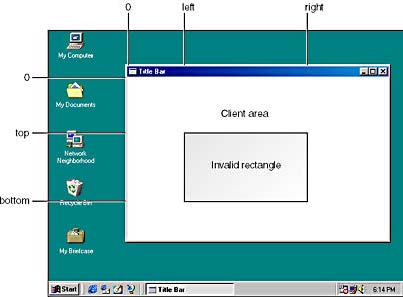
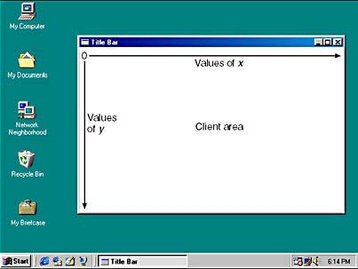
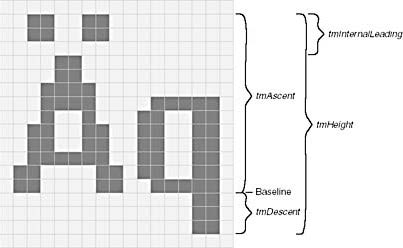
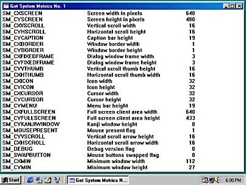

# 第 4 章 文本输出

第 3 章探讨了一个简单的 Windows 98 程序是怎样在其窗口中央，或更准确地说是在其客户区中央显示单行文本的。如我们所知，客户区是指整个应用程序窗口中没有被标题栏、边框、菜单栏、工具栏、状态栏和滚动条占用的区域。简而言之，客户区就是窗口中程序可以在上面绘制并向用户传达可视化信息的区域。  

在程序的客户区中，几乎可以做任何事情，但不能假定它有特定的尺寸，或者假定它的尺寸不会变化。如果对图形窗口界面编程不熟悉，可能会觉得有些不习惯，但作为开发人员，不能老想着一行就是 80 个字符。你写的程序必须和其他程序共享显示器。Windows 的用户控制着如何在屏幕上放置程序的窗口。尽管程序可以创建一个固定大小的窗口（例如计算器或类似的工具），但用户通常可以改变程序窗口的大小。应用程序必须接受为其指定的窗口并能在此前提下执行任务。  

这意味着两点。有时，程序会得到一个仅能显示「Hello」的客户区。有时如果运行在大屏幕、高分辨率的显示器上，它可能会有一个大到能放下整整两页文字而且周围还有很多空白的客户区。对于 Windows 程序来说，能够合理地处理这两种情形是很重要的。  

本章将学习程序是怎样在其客户区中显示信息的，其复杂程度比上一章描述的更甚。当程序在其客户区显示文本或图形时，通常我们称为它在「绘制」客户区。这便是本章的主题。  

虽然 Windows 有大量的图形设备接口（GDI）函数用于显示图形，但本章只讨论简单的文本行的显示。而且，本章还打算忽略 Windows 提供的各种字体和字号，只使用 Windows 的默认系统字体。这貌似很有局限性，但实际上并不然。我们在本章中遇到和解决的问题适用于所有 Windows 编程。同时显示文本和图形时， Windows 系统字体的字符尺寸通常决定着图形的尺寸。  

尽管本章从表面上看主题为绘制，但实际上是讲述和设备无关的编程基础。Windows 程序几乎不能假设自己的客户区有多大，甚至不能假设文本字符的大小。它们必须利用 Windows 提供的工具来获取程序运行环境的相关信息。  

## 4.1 绘制和重绘

在字符模式环境下，程序通常可以输出到显示器的任何位置。程序输出到显示器上的东西会留在那里而不会神秘消失。然后，程序可以不必保留重新显示所需要的任何信息。  

在 Windows 中，程序只能在自己窗口的客户区中显示文本和图形，你不能保证它们在程序重新输出到那里之前还会留在那里。例如，当用户在屏幕上移动其他程序的窗口时，可能会遮住应用程序的部分窗口。Windows 并不会保留被遮住的部分窗口。当其他程序的窗口被移开时， Windows 会要求你的程序重新绘制刚才被遮住的客户区。  

Windows 是一个消息驱动的系统。它使用两种方式把各种事件通知给应用程序：把消息放在应用程序的消息队列中，或者向适当的窗口过程直接发送消息。上例中，Windows 通过发送 `WM_PAINT` 消息来通知窗口过程其客户区需要重绘。  

### 4.1.1 WM_PAINT 消息

大多数 Windows 程序在 `WinMain` 函数初始化过程中会在进入消息循环之前调用 `UpdateWindow` 函数。Windows 利用这个机会向窗口过程发送最初的 `WM_PAINT` 消息。这个消息通知窗口过程绘制客户区。此后，窗口过程需要在几乎任何时间都能够处理新收到的 `WM_PAINT` 消息，而且能够在必要时重绘整个客户区。在以下任何一个事件发生时，窗口过程都会收到一条 `WM_PAINT` 消息：  

- 用户移动一个窗口，导致原来被遮盖的部分窗口暴露出来。  
- 用户调整窗口的大小（当窗口的类型设定为 `CS_HREDRAW` 和 `CS_VREDRAW` 值时）。  
- 程序调用 `ScrollWindow` 或 `ScrollDC` 函数滚动客户区。  
- 程序调用 `InvalidateRect` 或 `InvalidateRgn` 函数显式生成 `WM_PAINT` 消息。    

在某些情况下，当客户区的一部分被临时覆盖时， Windows 会试图保存被覆盖的这部分，以便将来恢复时使用。这并不是每次都能成功。在以下情形， Windows 有时会发送一条 `WM_PAINT` 消息：  

- Windows 关闭一个覆盖了部分窗口的对话框或消息框。  
- 下拉菜单被拉下然后收回。  
- 显示提示信息。  

在少数情况下，WINDOWS 总是会保存被覆盖部分的显示内容，然后再恢复。这些情况如下：  

- 鼠标指针在客户区内移动。  
- 在客户区内拖动图标。  

处理 `WM_PAINT` 消息需要你改变对于视频输出的概念。你的程序应该收集并保存所有用于绘制客户区的信息，但是只在需要时才进行绘制——当收到 `WM_PAINT` 消息时。如果程序需要在其他时候更新客户区，可以强制 Windows 生成 `WM_PAINT` 消息。这看上去貌似绕了一个弯，但是程序的结构会因此而受益。

### 4.1.2 有效矩形和无效矩形

尽管窗口过程必须能够在收到 `WM_PAINT` 消息时更新整个客户区，但通常它只需要更新其中的一部分，最常见的是更新其中的一个矩形区域。最明显的例子是当一个对话框覆盖了客户区的一部分时：当对话框被关闭时，只有先前被覆盖的那个矩形部分需要重新绘制。  

需要重新绘制的部分被称为「无效区域」或「更新区域」。在客户区中有一个无效区域将导致 Windows 在应用程序的消息队列中放置一条 `WM_PAINT` 消息。只有当程序客户区的一部分失效时，窗口过程才会接收到 `WM_PAINT` 消息。  

Windows 内部为每一个窗口都保存了一个「绘制信息结构」。这个结构保存着一个可以覆盖该无效区域的最小矩形的坐标和一些其他的信息。这个最小矩形被称为「无效矩形」。如果在窗口过程处理一条等候处理的 `WM_PAINT` 消息之前，客户区中的另外一部分也失效了，那么 Windows 将计算出一个覆盖这两个失效部分的新的无效区域和无效矩形，并更新绘制信息结构中的数据。Windows 不会在消息队列中放置多条 `WM_PAINT` 消息。  

窗口过程可以通过调用 `InvalidateRect` 函数来强制使自己的客户区中的一个矩形失效。如果消息队列中已经有一条 `WM_PAINT` 消息，Windows 就会计算出一个新的无效矩形。否则，Windows 会在消息队列里放置一条 `WM_PAINT` 消息。在本章的后面我们将看到，当窗口过程收到 `WM_PAINT` 消息时，它可以获得无效矩形的坐标。而在其他任何时候，它都可以通过调用 `GetUpdateRect` 函数来获取这些坐标。  

窗口过程在处理 `WM_PAINT` 消息时，在调用 `BeginPaint` 函数后，整个客户区会变成有效的。程序也可以通过调用`ValidateRect` 函数来使客户区中任意的矩形变得有效。如果该函数调用的结果是让整个无效区域都有效，那么当前消息队列中的 `WM_PAINT `消息就会被删除。

## 4.2 GDI 简介

绘制一个窗口的客户区需要调用 Windows 的图形设备接口（GDI）函数。Windows 提供了几个 GDI 函数用于在客户区内输出字符串。在第 3 章中，我们已经用过 `DrawText` 函数，但毫无疑问，最常用的字符输出函数应该是 `TextOut`。该函数的格式如下：  

```c
TextOut(hdc, x, y, psText, iLength);
```

`TextOut` 函数向窗口的客户区输出一个字符串。参数 `psText` 是指向字符串的指针，而 `iLength` 是字符串的长度（以字符为单位）。参数 `x` 和 `y` 定义了字符串在客户区中的开始位置。（很快我们将详细解释。）参数 `hdc` 是一个设备环境句柄。这是 GDI 的一个重要部分。几乎所有的 GDI 函数都需要这个句柄作为函数的第一个参数。  

### 4.2.1 设备环境

如前所述，句柄不过是一个数值，Windows 内部使用该数值确定一个对象。用户从 Windows 获取一个句柄，然后用于其他函数。设备环境句柄是程序窗口使用 GDI 函数的「通行证」。有了设备环境句柄，就可以随心所欲地绘制你的客户区。  

设备环境（也被简称为 DC）实际上是 GDI 内部维护的一个数据结构。设备环境与特定的显示设备（例如显示器或打印机）相关联。对于视频显示，设备环境通常与屏幕上的一个特定的窗口相关联。  

设备环境中的某些值是图形「属性」。这些属性决定了 GDI 绘图函数的工作细节。例如在 `TextOut` 函数中，设备环境的属性决定着文本的颜色、文本背景的颜色、函数的参数 `x` 和 `y` 如何映射到窗口的客户区，以及 Windows 用什么字体显示文本。  

程序在绘制前必须获取一个设备环境句柄。在获取句柄后，Windows 会在内部的设备环境结构中填入默认的属性值。在以后的章节中，你会学到有一些 GDI 函数可以改变这些默认值。有些 GDI 函数则能让你得到这些属性的当前值。当然，还有些 GDI 函数是让你真正在窗口的客户区进行绘图的。  

当程序完成了对客户区的绘制后，它必须释放设备环境句柄。在程序释放句柄之后，这个句柄不再有效并且不能再被使用。程序必须在处理同一条消息的过程中获取句柄和释放旬柄。你不能在两条消息中间传递一个设备环境句柄，唯一的例外是通过调用 `CreateDC` 函数创建的设备环境（在本章中我们不讨论这个函数）。  

Windows 应用程序需要在屏幕上绘图时，通常有两种方法获取设备环境句柄。

### 4.2.2 获取设备环境句柄：方法一

这种方法可以在处理 `WM_PAINT` 消息时使用。这牵涉两个函数：`BeginPaint` 和 `EndPaint`。这两个函数需要两个参数： 一个是窗口的句柄，这是窗口消息处理过程的参数；另一个是一个类型为 `PAINTSTRUCT` 结构的变量的地址。（`PAINTSTRUCT` 结构定义在 WINUSER.H 头文件中。）程序通常将这个变量命名为 `ps`，在窗口过程中定义如下：

```c
PAINTSTRUCT ps;
```

在处理 `WM_PAINT` 消息时，窗口过程首先调用 `BeginPaint` 函数。这个函数通常会擦去无效区域的背景以便绘图。它同时还会填充 `ps` 结构的各个字段。函数的返回值就是设备环境句柄。通常会将它保存在一个名为 `hdc` 的变量中。这个变量在窗口过程中定义如下：  

```c
HDC hdc;
```

`HDC` 数据类型定义为 32 位无符号整数。此后，程序可以调用任何一个需要设备环境句柄的 GDI 函数了，例如`TextOut`。调用一次 `EndPaint` 函数将释放设备环境句柄。

通常，处理 `WM_PAINT` 消息的代码如下所示：  

```c
case WM_PAINT:
	hdc = BeginPaint(hwnd, &ps);
	// 使用 GDI 函数
	EndPaint(hwnd, &ps);
	return 0;
```

窗口过程在处理 `WM_PAINT` 消息时必须成对地调用 `BeginPaint` 和 `EndPaint`。如果窗口过程不处理 `WM_PAINT` 消息， `WM_PAINT` 消息就会被传送给 Windows 默认的窗口过程 `DefWindowProc`。在 `DefWindowProc` 中，`WM_PAINT` 消息处理的代码如下：  

```c
case WM_PAINT:
	BeginPaint(hwnd, &ps);
	EndPaint(hwnd, &ps);
	return 0;
```

这里除了将原来的无效区域有效化以外，在 `BeginPaint` 和 `EndPaint` 的中间不包含其他代码。以下的代码是错误的：  

```c
case WM_PAINT:
	return 0;	// WRONG ! ! !
```

由于部分客户区是无效的，Windows 才会在消息队列中放置一条 `WM_PAINT` 消息。除非调用 `BeginPaint` 和 `EndPaint` 函数对（或者 `ValidateRect`），否则 Windows 不会将那个区域有效化。因此， Windows 将会不停地发送 `WM_PAINT` 消息，直到永远。

### 4.2.3 绘制信息结构

前面曾提到 Windows 将为每个窗口维护一个「绘制信息结构」。这便是 `PAINTSTRUCT`。这个结构的定义如下：  

```c
typedef struct tagPAINTSTRUCT
{
    HDC hdc;
    BOOL fErase;
    RECT rcPaint;
    BOOL fRestore;
    BOOL fIncUpdate;
    BYTE rgbReserved[32];
} PAINTSTRUCT;
```

当程序调用 `BeginPaint` 函数时，Windows 将自动填充这个结构中的字段。程序只能够使用前三个字段，其他的供 Windows 内部使用。`hdc` 字段是设备环境句柄。`BeginPaint` 函数的返回值就是这个设备环境句柄的值（这里表现了 Windows 典型的冗余性）。在大多数情况下，`tErase` 字段将被设置为 `FALSE`（即 0）。这意味着 Windows 在先前的 `BeginPaint` 函数中已经擦除了无效区域的背景。（如果想在窗口过程中自定义背景擦除方式，必须自己处理 `WM_ERASEBKGND` 消息。）在 `WINMAIN` 初始化时，用于注册窗口类的 `WNDCLASS` 结构中的 `hbrBackground` 字段指定了一个画刷，Windows 就使用这个画刷来擦除背景。很多 Windows 程序指定了一个白色的背景画刷。下面的语句可以完成这个任务：  

```c
wndclass.hbrBackground = (HBRUSH)GetStockObject(WHITE_BRUSH);
```

但是，当你的程序通过调用 `InvalidateRect` 函数使客户区中的一个矩形无效时，`InvalidateRect` 函数的最后一个参数将指定背景是否要被擦除。如果参数是 `FALSE`（即 0），Windows 将不会擦除背景，同时在调用 `BeginPaint` 函数后， `PAINTSTRUCT` 结构的 `fErase` 字段的值将是 `TRUE`（非 0）。  

`PAINTSTRUCT` 结构的 `rcPaint` 字段是一个 `RECT` 类型的结构。在第 3 章中，我们知道 `RECT` 结构使用 4 个字段 `left`、`top`、`right` 和 `bottom` 定义了一个矩形。`PAINTSTRUCT` 结构中的 `rcPaint` 字段定义了无效矩形的边界，如图 4-1 所示。这 4 个字段的值是以像素为单位的，并相对于客户区的左上角。该无效矩形就是用户程序需要进行重新绘制的区域。  



<div align=center>图 4-1 无效矩形的边界 </div>

`PAINTSTRUCT` 结构中的 `rcPaint` 矩形不仅仅是无效矩形，而且还是一个「裁剪」（Clipping）矩形。这意味着 Windows 将把绘制限制在这个矩形里。更确切地说，如果无效区域不是一个矩形， Windows 将把绘制限制在这个区域内。  

在处理 `WM_PAINT` 消息时，在调用 `BeginPaint` 之前调用以下的函数可以在该更新矩形之外绘制：  

```c
InvalidateRect(hwnd, NULL, TRUE);
```

这个调用将整个客户区无效化，并使其后调用的 `BeginPaint` 擦除原有的背景。如果将最后一个参数设为 `FALSE`，则随后调用的 `BeginPaint` 函数将不会擦除背景，也就是说原来的背景将被保留。  

通常来说，对于 Windows 程序最方便的做法是在收到 `WM_PAINT` 消息后，简单地重绘整个客户区而不管 `rcPaint` 结构的值如何。例如，如果客户区的显示包括一个圆，但是只有一部分落在无效区域里时，只画这个圆的一部分并不实际。简单的做法是重画整个圆。在使用从 `BeginPaint` 返回的设备环境句柄时，Windows 无论如何也不会在 `rcPaint` 定义的矩形之外绘制。  

在第 3 章的 HELLOWIN 程序中，我们在处理 `WM_PAINT `消息时并没有理会无效区域。如果文本显示的地方正好落在无效区域里，`DrawText` 函数就恢复那块区域。如果没有，那么Windows 在处理 `DrawText` 调用时会发现它不需要做任何事。但是这个过程要花时间。所以关心程序运行效率和速度的程序员（我希望每个程序员都会如此）会在处理 `WM_PAINT` 消息时使用无效矩形以避免不必要的 GDI 函数调用。如果绘制时需要从磁盘中读取文件（例如位图文件），这一点尤其重要。

### 4.2.4 获取设备环境句柄：方法二

尽管最好让程序在处理 `WM_PAINT` 消息时才更新整个客户区，但有时也会发现在处理非 `WM_PAINT` 消息时绘制部分客户区也是很有用的。有些时候，还需要设备环境句柄用作其他用途，例如获取设备环境的信息。  

你可以调用 `GetDC` 函数来获得窗口客户区的设备环境句柄，在使用完以后，调用 `ReleaseDC` 函数将它释放：  

```c
hdc = GetDC(hwnd);
// 使用 GDI 函数
ReleaseDC(hwnd, hdc);
```

与 `BeginPaint` 和 `EndPaint` 类似，`GetDC` 和 `ReleaseDC` 必须成对使用。在处理一条消息时，当调用 `GetDC` 函数后，应该在退出窗口过程之前调用 `ReleaseDC`。不要在处理一条消息时调用 `GetDC`，然后在处理另一条消息时调用 `ReleaseDC `。  

与从 `BeginPaint` 函数返回的设备环境句柄不同，从 `GetDC` 返回的设备环境句柄中的裁剪矩形是整个客户区。这意味着你可以在客户区的任意部分绘制，而不仅仅是在无效矩形里，也就是说如果不存在无效矩形也没有关系。与 `BeginPaint `不同，`GetDC` 不会将无效区域有效化。如果需要将整个客户区有效化，可以像下面这样调用函数：  

```c
ValidateRect(hwnd, NULL);
```

通常，`GetDC` 和 `ReleaseDC` 函数用于处理键盘消息（例如在字处理程序中）或者鼠标消息（例如绘图程序中）。使用这两个函数，程序可以在收到用户的键盘或鼠标输入时及时地绘制客户区，而不必为了生成 `WM_PAINT` 消息去刻意使客户区的一部分无效化。但是，即使程序在处理非 `WM_PAINT` 消息时进行了绘制，它仍然必须收集足够的信息以便在收到 `WM_PAINT` 时能更新显示。  

另一个与 `GetDC` 类似的函数是 `GetWindowDC`。`GetDC` 返回的是窗口客户区的设备环境句柄，`GetWindowDC` 返回的则是整个窗口的设备环境句柄。例如，程序可以使用从 `GetWindowDC` 返回的设备环境句柄在窗口的标题栏输出，相应的，程序也必须要处理 `WM_NCPAINT`（非客户区绘制）消息。 

### 4.2.5 TEXTOUT 函数详解

`TextOut` 是显示文本的最重要的 GDI 函数。它的语法如下：  

```c
TextOut(hdc, x, y, psText, iLength);
```

下面我们进一步讨论。  

第一个参数是设备环境句柄；它既可以是从 `GetDC` 返回的 `hdc` 值，也可以是处理 `WM_PAINT` 消息时从 `BeginPaint` 返回的 `hdc` 值。  

设备环境中的属性决定了文本显示的特性。例如，设备环境中的一个属性决定了文本的颜色，默认颜色是黑色。设备环境同时默认文本的背景颜色为白色。当程序输出文本时，Windows 将用这个背景色填充每个字符周围的矩形区域（我们称之为「字符框」）。  

文本背景色和在窗口类中设定的背景色是不一样的。窗口类中的背景色是 Windows 用来擦除客户区的刷子，它是一种图样，既可以是纯色，也可以不是纯色。它并不是设备环境结构的一部分。在定义窗口类时，大多数应用程序选择 `WHITE_BRUSH` 作为背景，这样，设备环境中默认的文本背景色就和 Windows 用来擦除客户区的背景色相同了。  

参数 `psText` 是指向字符串的指针，而 `iLength` 是字符串中的字符数。如果 `psText` 指向一个 Unicode 字符串，则字符串占用的字节数将是 `iLength` 的两倍。字符串中不应该有任何 ASCII 控制字符，例如回车键、换行符、制表符或退格键。Windows 将这些控制字符显示为空心或实心方块。`TextOut` 并不认为字符串尾部值为 0 字节（对 UNICODE 而言是值为 0的双字节）表示字符串结束，它利用 `iLength` 参数来决定字符串的长度。  

参数 `x` 和 `y` 决定着输出字符串在客户区的起始位置。`x` 是水平位置，而 `y` 是垂直位置。第一个字符的左上角定位在坐标点 (x, y)。在默认的设备环境中，坐标原点位于客户区的左上角。如果传给 `TextOut` 的 x 和 y 值都是 0，则字符串将紧靠客户区的左上角。  

在类似于 `TextOut` 的 GDI 绘图函数的文档中，传给函数的坐标值通常被称为「逻辑坐标」。它的具体含义我们将在第 5 章讨论。现在要注意的是，Windows 有各种「映射模式」来决定怎样将 GDI 绘图函数中的逻辑坐标转换成显示器上的物理像素坐标。这些映射模式在设备环境中定义。默认的映射模式是 `MM_TEXT`（标识符定义在 WINGDI.H 头文件中）。 `MM_TEXT` 映射模式下，逻辑单位和物理单位都是像素点，坐标是相对于客户区的左上角，x 的值从左往右增大，y 的值从上往下增大。（如图 4-2）`MM_TEXT` 中的坐标系统与 Windows 在 `PAINTSTRUCT` 结构中定义无效矩形的坐标系统是一致的。（然而在其他映射模式下就不是这么方便了。）  

设备环境同时定义了一个裁剪区域。如前所述，从 `GetDC` 得到的设备环境句柄中，该裁剪区域就是整个客户区；从 `BeginPaint` 得到的设备环境句柄中，该裁剪区域则是无效区域。在调用 `TextOut` 时，Windows 将不会显示字符串落在裁剪区域外的部分。如果一个字符只有一部分在裁剪区域里，那么只有这部分会显示。在客户区之外显示并不是很容易，所以不必担心无意中会发生那样的事情。



<div align=center>图 4-2 MM_TEXT 映射模式下的坐标值</div>

### 4.2.6 系统字体

设备环境同时还定义了在调用 `TextOut` 时 Windows 使用的字体。默认的字体称为「系统字体」或 `SYSTEM_FONT`（标识符定义在 WINGDI.H 头文件中）。系统字体是 Windows 在标题栏、菜单和对话框中使用的默认字体。  

在早期的 Windows 中，系统字体是一种等宽字体：所有字符的宽度是一样的，就像打字机那样。但从 Windows 3.0 开始，系统字体变成了变宽字体：每个字符的宽度是不一样的，例如，字符 W 就比字符 i 要宽。很多相关阅读研究表明，用变宽字体印刷的文章比用等宽字体印刷的可读性更强，其原理是当字符排列得更紧凑时，眼睛和大脑更容易注意到单词而不仅仅是一个个的字符。可想而知，从等宽字体变到变宽字体导致很多早期的Windows 程序不再适用，程序员们需要学习使用字体的新技术。  

系统字体是一种「点阵字体」：每个字符由像素点构成。（第 17 章将学习 TrueType 字体，由轮廓定义字符。）在某种程度上，系统字体中字符的大小取决于显示器的大小：系统字体的设计要求能够在显示器上起码显示 25 行 80 列字符。  

### 4.2.7 字符大小

为了用 `TextOut` 函数显示多行文本，就需要知道字体中字符的尺寸。由字符的高度可以决定下一行文字的垂直位置，而由字符的平均宽度可以决定下一栏文本的水平位置。  

那么系统字体中字符的平均宽度是多少？我不会告诉你，或者说，我不知道，即使我说了，很可能答案也是错的。因为这取决于显示器的分辨率。Windows 要求的最低分辨率是 640x480，但很多用户喜欢 800x600 或1024x768。而且，在这些高一点的分辨率下，用户还可以选择不同的系统字体的字号。  

程序可以通过调用 `GetSystemMetrics` 函数来获取用户界面的尺寸，同样地，通过调用 `GetTextMetrics` 函数，程序可以获取字体尺寸。`GetTextMetrics` 函数需要一个设备环境句柄，因为它会返回该设备环境中当前选定的字体的信息。 Windows 将把字符尺寸的各种值复制到类型为 `TEXTMETRIC` 的结构中，该结构在 WINGDI.H 头文件中定义，有 20 个字段，但我们仅关心其中前 7 个：  

```c
typedef struct tagTEXTMETRIC
{
    LONG tmHeight;
    LONG tmAscent;
    LONG tmDescent;
    LONG tmInternalLeading;
    LONG tmExternalLeading;
    LONG tmAveCharWidth;
    LONG tmMaxCharWidth;
    // 其他结构字段
}
TEXTMETRIC, * PTEXTMETRIC;
```

这些字段的值的单位取决于设备环境中当前选定的映射模式。默认的映射模式是 `MM_TEXT`，所以它们的值是以像素为单位的。  

在调用 `GetTextMetrics` 函数前，首先要定义一个结构变量，通常命名为 `tm`：  

```c
TEXTMETRIC tm;
```

需要获取字号时，首先获取设备环境句柄，然后调用 `GetTextMetrics`：  

```c
hdc = GetDC(hwnd);
GetTextMetrics (hdc, &tm);
ReleaseDC(hwnd, hdc);
```

在这之后就可以检查文字尺寸结构中的值，并保存以后需要使用的部分。  

### 4.2.8 文本尺寸的度量

在 `TEXTMETRICS` 结构中有设备环境中当前字体的各种信息。但字体的纵向尺寸仅由其中的 5 项决定，图 4-3 显示了其中的 4 项。  

其中最重要的是 `tmHeight`，它是 `trnAscent` 和 `tmDescent` 的和。这两个值分别是字符在基线之上和之下的最大高度。间距（leading）是两行文字之间的空间。在 `TEXTMETRICS` 结构里，内部间距 `tmInternalLeading` 包含在 `tmAscent` 中（也就包括在 `tmHeight` 中），该间距通常被用于显示重音符号。`tmInternalLeading` 的值可以设为 0，在这种情况下，带重音符号的字符会稍微短一点，以便把重音符号包括在内。  



<div align=center>图 4-3 字体中定义字符纵向尺寸的 4 个值</div>

`TEXTMETRICS` 结构中的另一个字段是 `tmExternalLeading`，它并不包含在 `tmHeight` 的值里。该字段是字体设计者建议在两行文字间留出的空间大小。在显示多行文字时，可以选择接受或者不理会这个建议。在我最近使用的系统字体中，这个值是 0，这也就是为什么在图 4-3 中没有它。（尽管我说过不会讲具体的系统字号，但图 4-3 精确反映了 Windows 在 640x480 分辨率下的默认系统字体。）  

`TEXTMETRICS` 结构中有两个字段描述了字符的宽度：`tmAveCharWidth` 是小写字符的加权平均宽度，`tmMaxCharWidth ` 是字体中最宽的字符的宽度。在等宽字体中，这两个值是一样的。（在图 4-3 所示的字体中，这两个值分别是 7 和 14。）在本章的范例程序中还有另一种字符宽度：大写字符的平均宽度。该值大小通常可以按 `tmAveCharWidth` 的 1.5 倍计算。  

值得重视的是，系统字体的尺寸取决于 Windows 运行时的显示分辨率，有时还取决于用户选定的系统字号。Windows 提供了与设备无关的图形界面，但程序员也需要注意：不要在 Windows 应用程序中猜测文本的尺寸，不要使用固定的值，应该通过调用 `GetTextMetrics` 函数来获取这些信息。  

### 4.2.9 文本的格式化

Windows 运行时，系统字体不会变化。因此，应用程序只需要调用一次 `GetTextMetrics` 函数。最好的时机是在窗口过程处理 `WM_CREATE` 消息时。`WM_CREATE` 消息是窗口过程收到的第一条消息。当应用程序在 `WinMain` 中调用 `CreateWindow` 时，Windows 将传送一条 `WM_CREATE` 消息给窗口过程。  

假设你的 Windows 程序需要在客户区内显示几行文本，你需要获取字符的宽度和高度。在窗口过程中，可以定义两个变量来保存字符的平均宽度和总高度：  

```c
static int cxChar, cyChar;
```

变量名的前缀 `c `代表「count」，也即「个数」，在这里代表像素数。和 `x` 与 `y` 结合，分别表示宽度和高度。它们被定义为静态变量，因为它们必须在 Windows 处理其他消息（例如 `WM_PAINT` 消息）时还有效。它们也可以定义为全局变量，也就是定义在所有函数之外。  

以下的 `WM_CREATE` 代码显示了怎样获取系统字体的宽度和高度：  

```c
case WM_CREATE:
    hdc = GetDC(hwnd);
    GetTextMetrics(hdc, &tm);
    cxChar = tm.tmAveCharWidth;
    cyChar = tm.tmHeight + tm.tmExternalLeading;
    ReleaseDC(hwnd, hdc);
    return 0;
```

注意，这里在 `cyChar` 中包括了 `tmExtemalLeading`。尽管在我前面用到的系统字体中，这一项通常是 0，但考虑到它可能不是 0，还是需要包括它，因为这会使行与行之间更清晰易读。在窗口中，每一行文本显示在上一行文本下方 `cyChar ` 个像素处。  

通常需要显示的是格式化的数字和字符串。如第 2 章所述，不能用传统的工具（例如 `printf` 函数），但是可以使用 `sprintf` 或者 Windows 版的 `sprintf` 与 `wsprintf`。这些函数与 `printf` 功能类似，区别在于格式化后的字符保存在一个字符串里。这个字符串可以通过 `TextOut` 函数输出到窗口中。方便的是，`sprintf` 和 `wsprintf` 的返回值是字符串的长度，这可以传给 `TextOut` 函数作为 `iLength` 参数。下面的代码是典型的 `wsprintf` 和 `TextOut` 的组合：  

```c
int iLength;
TCHAR szBuffer [40];
// 其他程序行
iLength = wsprintf(szBuffer, TEXT("The sum of %i and %i is %i"),
	iA, iB, iA + iB);
TextOut(hdc, x, y, szBuffer, iLength);
```

对千这样简单的代码，也可以省略 `iLength` 的定义，而把两条语句合为一条，如下所示：  

```c
TextOut(hdc, x, y, szBuffer,
	wsprintf (szBuffer, TEXT("The sum of %i and %i is %i"),
	iA, iB, iA + iB));
```

这也许看起来不那么直观，但功能是一样的。  

### 4.2.10 综合使用

到现在，我们学到了编写一个显示多行字符的程序所需要的所有知识。我们知道怎样在 `WM_PAINT` 消息中获取设备环境句柄，怎样调用 `TextOut` 函数，怎样根据字符的大小安排字距。剩下需要做的就是显示一些有意义的东西。  

在第 3 章中，我们稍微看了一下从 `GetSystemMetrics` 函数中获取的有趣信息。这个函数返回的是 Windows 中各种图形项（例如图标、鼠标指针、标题栏和滚动条）的尺寸信息。在不同的显示卡和驱动程序中，这些尺寸是不一样的。为了在程序中做到与设备无关的图形输出，`GetSystemMetrics` 是一个很重要的函数。  

这个函数需要一个称为「索引」的参数。这是在 Windows 头文件中定义的 75 个整型标识符中的一个。（这些标识符的数量随着新版本的 Windows 的发布而不断增加，在 Windows 1.0 中还只有 26 个。）`GetSystemMetrics` 函数的返回值是一个整数，它的值通常是索引参数所指定的 Windows 组件的大小。  

让我们来写一个程序显示调用 `GetSystemMetrics` 函数获取的部分信息，每一行显示一项信息。为了方便起见，我们先写一个头文件，其中定义了一个结构数组，该数组中每个结构都包括了 Windows 头文件中用于 `GetSystemMetrics` 的索引，以及我们希望为每个返回的值而显示的文字。这个头文件是 SYSMETS.H，如图 4-4 所示。  

```c
/*-----------------------------------------------
SYSMETS.H -- System metrics display structure
-----------------------------------------------*/
#define NUMLINES ((int) (sizeof sysmetrics / sizeof sysmetrics [0]))
struct
{
    int iIndex;
    TCHAR * szLabel;
    TCHAR * szDesc;
}
sysmetrics [] =
{
    SM_CXSCREEN, 		TEXT("SM_CXSCREEN"),
	    				TEXT("Screen width in pixels"),
    SM_CYSCREEN, 		TEXT("SM_CYSCREEN"),
					    TEXT("Screen height in pixels"),
    SM_CXVSCROLL, 		TEXT("SM_CXVSCROLL"),
    					TEXT("Vertical scroll width"),
    SM_CYHSCROLL, 		TEXT("SM_CYHSCROLL"),
				    	TEXT("Horizontal scroll height"),
    SM_CYCAPTION, 		TEXT("SM_CYCAPTION"),
				    	TEXT("Caption bar height"),
    SM_CXBORDER, 		TEXT("SM_CXBORDER"),
				    	TEXT("Window border width"),
    SM_CYBORDER, 		TEXT("SM_CYBORDER"),
				    	TEXT("Window border height"),
    SM_CXFIXEDFRAME, 	TEXT("SM_CXFIXEDFRAME"),
				    	TEXT("Dialog window frame width"),
    SM_CYFIXEDFRAME, 	TEXT("SM_CYFIXEDFRAME"),
				    	TEXT("Dialog window frame height"),
    SM_CYVTHUMB, 		TEXT("SM_CYVTHUMB"),
				    	TEXT("Vertical scroll thumb height"),
    SM_CXHTHUMB, 		TEXT("SM_CXHTHUMB"),
				    	TEXT("Horizontal scroll thumb width"),
    SM_CXICON, 			TEXT("SM_CXICON"),
				    	TEXT("Icon width"),
    SM_CYICON, 			TEXT("SM_CYICON"),
				    	TEXT("Icon height"),
    SM_CXCURSOR, 		TEXT("SM_CXCURSOR"),
				    	TEXT("Cursor width"),
    SM_CYCURSOR, 		TEXT("SM_CYCURSOR"),
				    	TEXT("Cursor height"),
    SM_CYMENU, 			TEXT("SM_CYMENU"),
				    	TEXT("Menu bar height"),
    SM_CXFULLSCREEN, 	TEXT("SM_CXFULLSCREEN"),
				    	TEXT("Full screen client area width"),
    SM_CYFULLSCREEN, 	TEXT("SM_CYFULLSCREEN"),
				    	TEXT("Full screen client area height"),
    SM_CYKANJIWINDOW, 	TEXT("SM_CYKANJIWINDOW"),
    					TEXT("Kanji window height"),
    SM_MOUSEPRESENT, 	TEXT("SM_MOUSEPRESENT"),
    					TEXT("Mouse present flag"),
    SM_CYVSCROLL, 		TEXT("SM_CYVSCROLL"),
    					TEXT("Vertical scroll arrow height"),
    SM_CXHSCROLL, 		TEXT("SM_CXHSCROLL"),
    					TEXT("Horizontal scroll arrow width"),
    SM_DEBUG, 			TEXT("SM_DEBUG"),
    					TEXT("Debug version flag"),
    SM_SWAPBUTTON, 		TEXT("SM_SWAPBUTTON"),
    					TEXT("Mouse buttons swapped flag"),
    SM_CXMIN, 			TEXT("SM_CXMIN"),
    					TEXT("Minimum window width"),
    SM_CYMIN, 			TEXT("SM_CYMIN"),
    					TEXT("Minimum window height"),
    SM_CXSIZE, 			TEXT("SM_CXSIZE"),
    					TEXT("Min/Max/Close button width"),
    SM_CYSIZE, 			TEXT("SM_CYSIZE"),
    					TEXT("Min/Max/Close button height"),
    SM_CXSIZEFRAME, 	TEXT("SM_CXSIZEFRAME"),
    					TEXT("Window sizing frame width"),
    SM_CYSIZEFRAME, 	TEXT("SM_CYSIZEFRAME"),
    					TEXT("Window sizing frame height"),
    SM_CXMINTRACK, 		TEXT("SM_CXMINTRACK"),
    					TEXT("Minimum window tracking width"),
    SM_CYMINTRACK, 		TEXT("SM_CYMINTRACK"),
    					TEXT("Minimum window tracking height"),
    SM_CXDOUBLECLK, 	TEXT("SM_CXDOUBLECLK"),
    					TEXT("Double click x tolerance"),
    SM_CYDOUBLECLK, 	TEXT("SM_CYDOUBLECLK"),
    					TEXT("Double click y tolerance"),
    SM_CXICONSPACING, 	TEXT("SM_CXICONSPACING"),
    					TEXT("Horizontal icon spacing"),
    SM_CYICONSPACING, 	TEXT("SM_CYICONSPACING"),
    					TEXT("Vertical icon spacing"),
    SM_MENUDROPALIGNMENT, TEXT("SM_MENUDROPALIGNMENT"),
    					TEXT("Left or right menu drop"),
    SM_PENWINDOWS, 		TEXT("SM_PENWINDOWS"),
    					TEXT("Pen extensions installed"),
    SM_DBCSENABLED, 	TEXT("SM_DBCSENABLED"),
    					TEXT("Double-Byte Char Set enabled"),
    SM_CMOUSEBUTTONS, 	TEXT("SM_CMOUSEBUTTONS"),
						TEXT("Number of mouse buttons"),
    SM_SECURE, 			TEXT("SM_SECURE"),
    					TEXT("Security present flag"),
    SM_CXEDGE, 			TEXT("SM_CXEDGE"),
    					TEXT("3-D border width"),
    SM_CYEDGE,			TEXT("SM_CYEDGE"),
    					TEXT("3-D border height"),
    SM_CXMINSPACING, 	TEXT("SM_CXMINSPACING"),
    					TEXT("Minimized window spacing width"),
    SM_CYMINSPACING, 	TEXT("SM_CYMINSPACING"),
    					TEXT("Minimized window spacing height"),
    SM_CXSMICON, 		TEXT("SM_CXSMICON"),
    					TEXT("Small icon width"),
    SM_CYSMICON, 		TEXT("SM_CYSMICON"),
    					TEXT("Small icon height"),
    SM_CYSMCAPTION, 	TEXT("SM_CYSMCAPTION"),
    					TEXT("Small caption height"),
    SM_CXSMSIZE, 		TEXT("SM_CXSMSIZE"),
    					TEXT("Small caption button width"),
    SM_CYSMSIZE, 		TEXT("SM_CYSMSIZE"),
    					TEXT("Small caption button height"),
    SM_CXMENUSIZE, 		TEXT("SM_CXMENUSIZE"),
    					TEXT("Menu bar button width"),
    SM_CYMENUSIZE, 		TEXT("SM_CYMENUSIZE"),
    					TEXT("Menu bar button height"),
    SM_ARRANGE, 		TEXT("SM_ARRANGE"),
    					TEXT("How minimized windows arranged"),
    SM_CXMINIMIZED, 	TEXT("SM_CXMINIMIZED"),
    					TEXT("Minimized window width"),
    SM_CYMINIMIZED, 	TEXT("SM_CYMINIMIZED"),
    					TEXT("Minimized window height"),
    SM_CXMAXTRACK, 		TEXT("SM_CXMAXTRACK"),
    					TEXT("Maximum draggable width"),
    SM_CYMAXTRACK, 		TEXT("SM_CYMAXTRACK"),
    					TEXT("Maximum draggable height"),
    SM_CXMAXIMIZED, 	TEXT("SM_CXMAXIMIZED"),
    					TEXT("Width of maximized window"),
    SM_CYMAXIMIZED, 	TEXT("SM_CYMAXIMIZED"),
    					TEXT("Height of maximized window"),
    SM_NETWORK, 		TEXT("SM_NETWORK"),
    					TEXT("Network present flag"),
    SM_CLEANBOOT, 		TEXT("SM_CLEANBOOT"),
    					TEXT("How system was booted"),
    SM_CXDRAG, 			TEXT("SM_CXDRAG"),
    					TEXT("Avoid drag x tolerance"),
    SM_CYDRAG, 			TEXT("SM_CYDRAG"),
    					TEXT("Avoid drag y tolerance"),
    SM_SHOWSOUNDS, 		TEXT("SM_SHOWSOUNDS"),
    					TEXT("Present sounds visually"),
    SM_CXMENUCHECK, 	TEXT("SM_CXMENUCHECK"),
    					TEXT("Menu check-mark width"),
    SM_CYMENUCHECK, 	TEXT("SM_CYMENUCHECK"),
    					TEXT("Menu check-mark height"),
    SM_SLOWMACHINE, 	TEXT("SM_SLOWMACHINE"),
    					TEXT("Slow processor flag"),
    SM_MIDEASTENABLED, 	TEXT("SM_MIDEASTENABLED"),
    					TEXT("Hebrew and Arabic enabled flag"),
    SM_MOUSEWHEELPRESENT, TEXT("SM_MOUSEWHEELPRESENT"),
    					TEXT("Mouse wheel present flag"),
    SM_XVIRTUALSCREEN, 	TEXT("SM_XVIRTUALSCREEN"),
    					TEXT("Virtual screen x origin"),
    SM_YVIRTUALSCREEN, 	TEXT("SM_YVIRTUALSCREEN"),
    					TEXT("Virtual screen y origin"),
    SM_CXVIRTUALSCREEN, TEXT("SM_CXVIRTUALSCREEN"),
   						TEXT("Virtual screen width"),
    SM_CYVIRTUALSCREEN, TEXT("SM_CYVIRTUALSCREEN"),
						TEXT("Virtual screen height"),
    SM_CMONITORS, 		TEXT("SM_CMONITORS"),
    					TEXT("Number of monitors"),
    SM_SAMEDISPLAYFORMAT, TEXT("SM_SAMEDISPLAYFORMAT"),
    					TEXT("Same color format flag")
};
```

<div align=center>图 4-4 SYSMETS.H 文件</div>

用于显示信息的程序名为 SYSMETS1。SYSMETS1.C 的源代码如图 4-5 所示。其中的大部分代码应该很熟悉了， `WinMain` 几乎和 HELLOWIN 的一样，而 `WndProc` 中的大部分代码也都已经讨论过了。  

```c
/*----------------------------------------------------
SYSMETS1.C -- System Metrics Display Program No. 1
(c) Charles Petzold, 1998
----------------------------------------------------*/
#include <windows.h>
#include "sysmets.h"

LRESULT CALLBACK WndProc(HWND, UINT, WPARAM, LPARAM);

int WINAPI WinMain(HINSTANCE hInstance, HINSTANCE hPrevInstance,
					PSTR szCmdLine, int iCmdShow)
{
    static TCHAR szAppName[] = TEXT("SysMets1");
    HWND hwnd;
    MSG msg;
    WNDCLASS wndclass;
    
    wndclass.style = CS_HREDRAW | CS_VREDRAW;
    wndclass.lpfnWndProc = WndProc;
    wndclass.cbClsExtra = 0;
    wndclass.cbWndExtra = 0;
    wndclass.hInstance = hInstance;
    wndclass.hIcon = LoadIcon(NULL, IDI_APPLICATION);
    wndclass.hCursor = LoadCursor(NULL, IDC_ARROW);
    wndclass.hbrBackground =(HBRUSH)GetStockObject(WHITE_BRUSH);
    wndclass.lpszMenuName = NULL;
    wndclass.lpszClassName = szAppName;
    
    if(!RegisterClass(&wndclass))
    {
        MessageBox(NULL, TEXT("This program requires Windows NT!"),
        	szAppName, MB_ICONERROR);
        return 0;
    }
    
    hwnd = CreateWindow(szAppName, TEXT("Get System Metrics No. 1"),
    					WS_OVERLAPPEDWINDOW,
    					CW_USEDEFAULT, CW_USEDEFAULT,
    					CW_USEDEFAULT, CW_USEDEFAULT,
    					NULL, NULL, hInstance, NULL);
    
    ShowWindow(hwnd, iCmdShow);
    UpdateWindow(hwnd);
    
    while(GetMessage(&msg, NULL, 0, 0))
    {
        TranslateMessage(&msg);
        DispatchMessage(&msg);
    }
    return msg.wParam;
}

LRESULT CALLBACK WndProc(HWND hwnd, UINT message, 
                          WPARAM wParam, LPARAM lParam)
{
    static int cxChar, cxCaps, cyChar;
    HDC hdc;
    int i;
    PAINTSTRUCT ps;
    TCHAR szBuffer [10];
    TEXTMETRIC tm;
    
    switch(message)
    {
        case WM_CREATE:
            hdc = GetDC(hwnd);
            GetTextMetrics(hdc, &tm);
            cxChar = tm.tmAveCharWidth;
            cxCaps = (tm.tmPitchAndFamily & 1 ? 3 : 2) * cxChar / 2;
            cyChar = tm.tmHeight + tm.tmExternalLeading;
            ReleaseDC(hwnd, hdc);
            return 0;
        case WM_PAINT:
            hdc = BeginPaint(hwnd, &ps);
            for(i = 0; i < NUMLINES; i++)
            {
                TextOut(hdc, 0, cyChar * i,
                	sysmetrics[i].szLabel,
	                lstrlen(sysmetrics[i].szLabel));
                TextOut(hdc, 22 * cxCaps, cyChar * i,
                	sysmetrics[i].szDesc,
                	lstrlen(sysmetrics[i].szDesc));
                SetTextAlign(hdc, TA_RIGHT | TA_TOP);
                TextOut(hdc, 22 * cxCaps + 40 * cxChar, cyChar * i, szBuffer,
                	wsprintf(szBuffer, TEXT("%5d"),
                	GetSystemMetrics(sysmetrics[i].iIndex)));
                SetTextAlign(hdc, TA_LEFT | TA_TOP);
            }
            EndPaint(hwnd, &ps);
            return 0;
        case WM_DESTROY:
        	PostQuitMessage(0);
        return 0;
    }
    return DefWindowProc(hwnd, message, wParam, lParam);
}
```

<div align=center>图 4-5 SYSMETS1.C</div>

图 4-6 是 SYSMETS1 在标准的 VGA 下运行的结果。从客户区显示的前两行中可以看到屏幕的宽度是 640 像素，而高度是 480 像素。这两个值，和其他的许多值，会根据不同的显示设备而不同。  



<div align=center>图 4-6 SYSMETS1 的显示</div>

### 4.2.11 SYSMETS1.C  窗口过程

SYSMETS1.C 的窗口过程 `WndProc `处理三条消息：`WM_CREATE `、`WM_PAINT ` 和 `WM_DESTROY`。`WM_DESTROY` 消息的处理方法和第 3 章 HELLOWIN 程序中的处理是一样的。  

`WM_CREATE` 消息是窗口过程收到的第一条消息，当调用 `CreateWindow` 函数创建窗口时，Windows 生成这条消息。在处理 `WM_CREATE` 消息时，SYSMETS1 通过调用 `GetDC` 函数获取窗口的设备环境，并调用 `GetTextMetrics` 函数获取默认系统字体的尺寸。SYSMETS1 将平均字符宽度保存在变量 `cxChar` 中，将字符的总高度（包括外部间距）保存在变量 `cyChar` 中。  

SYSMETS1 还将大写字符的平均宽度保存在静态变量 `cxCaps `中。在等宽字体中，`cxCaps `等于 `cxChar`。在变宽字体中， `cxCaps`设为 `cxChar` 的 1.5 倍。在 `TEXTMETRIC` 结构中，`tmPitchAndFamily` 字段的低位决定字体是否为等宽字体：1 代表变宽字体，0 代表等宽字体。SYSMETS1 利用这个来计算 `cxCaps`：  

```c
cxCaps = (tm.tmPitchAndFamily & 1 ? 3 : 2) * cxChar / 2;
```

SYSMETS1 在处理 `WM_PAINT` 消息时完成所有的绘制工作。与往常一样，窗口过程首先调用 `BeginPaint` 函数获取设备环境句柄。一个 `for` 循环语句扫描在 SYSMETS.H 中定义的 `sysmetrics` 结构的每一行。三栏文本分别由三个 `TextOut` 函数调用输出。在每一次循环中，`TextOut `的第三个参数（y 的起始位置）如下设置：  

```c
cyChar * i
```

这个参数指定了每行字符的顶部相对于客户区的顶部的位置。  

调用第一个 `TextOut` 函数将在第一栏中输出大写的标识符。该 `TextOut` 函数的第二个参数为 0，表示将从客户区的最左边开始输出。输出的字符串从 `sysmetrics `结构的 `szLabel` 字段得到。我用 Windows 函数 `lstrlen `计算字符串的长度，并传给 `TextOut` 作为最后一个参数。  

调用第二个 `TextOut` 函数将输出对系统尺寸值的描述。这些描述保存在 `sysmetrics` 结构的 `szDesc` 字段中。在这里， `TextOut` 函数的第二个参数如下：  

```c
22 * cxCaps
```

在第一栏里显示的字符串最长有 20 个字符，所以第二栏必须从第一栏开始处向右至少 20 × `cxCaps` 处开始。我用 22 以便在两栏中留出额外的空间。  

调用第三个 `TextOut `函数将输出从 `GetSystemMetrics` 函数调用获取的数值。变宽字体使得格式化右对齐的数值不太容易。幸运的是，在现在的所有变宽字体中，数字 0 到 9 的宽度是一样的，否则的话，显示数字栏的工作将令人望而生畏。不过，数字的宽度比空格要宽。由于数值可以是一位数也可能是多位数，要做到右对齐，不同的数值要从不同的水平位置开始输出。  

如果在显示右对齐的数字时，可以指定显示的结束位置而不是开始位置，事情将会容、易许多。这正是 `SetTextAlign` 函数可以做到的事情之一。在 SYSMETS1 中，下面的函数调用  

```c
SetTextAlign(hdc, TA_RIGHT | TA_TOP);
```

通知 Windows 后继的 `TextOut`函数调用使用的坐标将从客户区的右上角开始，而不是从左上角开始。  

用千显示数值栏的 `TextOut` 函数的第二个参数如下设置：  

```c
22 * cxCaps + 40 * cxChar
```

其中 40 × `cxChar` 的值包括了第二栏和第三栏的宽度。在调用了这个 `TextOut` 后，另一个 `SetTextAlign` 函数调用将对齐方式设回为正常方式。  

### 4.2.12 空间不够

SYSMETS1 程序有一个麻烦的问题：除非你有一个大屏幕的高清晰显卡，否则系统尺寸列表的很多行你是看不到的。如果把窗口变窄，你甚至连输出的数值也看不到。  

SYSMETS1 程序并没有意识到这个问题，否则我们可以包含一个消息框，显示「Sorry! 」。它没有意识到这个问题是因为它甚至不知道客户区的大小。它简单地从窗口的顶部开始显示，依赖 Windows 把落在客户区之外的部分给裁剪掉。  

显然，这不是理想的结果。解决这个问题的第一步是确定客户区中可以容纳多少输出。

### 4.2.13 客户区的尺寸

你会发现已有的 Windows 应用程序中，窗口的尺寸可以有很大的变化。如果窗口被最大化，客户区可以占据几乎整个显示屏。事实上，当用 `SM_CXFULLSCREEN` 和 `SM_ CYFULLSCREEN` 作为参数来调用 `GetSystemMetrics` 函数时，可以得到窗口被最大化时的客户区尺寸（假定窗口只有标题栏，没有菜单栏）。而最小的窗口可以很小，小到几乎不存在，而客户区也就几乎不存在了。  

在第 3 章中，我们用 `GetClientRect` 函数来获取客户区的大小。这没有问题，但如果每次需要时都要调用这个函数显然没有效率。更好的办法是在窗口过程处理 `WM_SIZE` 消息时获取窗口的客户区的大小。当窗口的大小发生变化时，  Windows 会向窗口过程发送一条 `WM_SIZE` 消息。相应的 `lParam` 变量的低位字是客户区的宽度，而高位字是高度。可以在窗口过程中定义两个静态变量来保存这两个值：  

```c
static int cxClient, cyClient;
```

与 `cxChar `和 `cyChar` 类似，这两个变量定义成静态变量，因为它们会在处理一条消息时被赋值，而在处理另一条消息时被使用。可以如下处理 `WM_SIZE` 消息：  

```c
case WM_SIZE:
    cxClient = LOWORD(lParam);
    cyClient = HIWORD(lParam);
    return 0;
```

这样的代码出现在几乎所有的 Windows 程序中。`LOWORD` 和 `HIWORD` 是在 Windows头文件 WINDEF.H 中定义的两个宏。它们的定义如下：  

```c
#define LOWORD(l) ((WORD) (l))
#define HIWORD(l) ((WORD) (((DWORD) (l) >> 16) & OxFFFF))
```

这两个宏返回 `WORD` 值，也就是 16 位无符号整数（从0 到 0xFFFF）。通常你会将这些值保存在 32 位有符号整型变量中。这并不会牵涉到任何转换问题，而且将来在计算时会比较方便。  

在许多 Windows 程序中， `WM_SIZE` 消息之后经常会有一个 `WM_PAINT` 消息。为什么呢？因为在定义窗口类时，我们如下指定窗口的风格：  

```c
CS_HREDRAW | CS_VREDRAW
```

它告诉 Windows 在窗口的水平或垂直尺寸变化时强制重绘。  

下面的公式可以计算出客户区可以显示的整行字符数：  

```c
cyClient / cyChar
```

当窗口小到不能显示一整行字符时，这个值为 0 。类似的，在窗口的客户区中可以水平显示的小写字符数等于：  

```c
cxClient / cxChar
```

如果在处理 `WM_CREATE` 消息时将 `cxChar` 和 `cyChar` 赋值，则不必担心被 0 除的问题。当 `WinMain` 函数调用 `CreateWindow` 时，窗口过程收到 `WM_CREATE` 消息，而第一条 `WM_SIZE` 消息将发生在那之后，在 `WinMain` 函数调用 `ShowWindow` 函数时。这时的 `cxChar` 和 `cyChar` 已经被赋予了非 0 值。  

为了让用户在窗口不够大时可以卷动客户区内的文字，获得窗口的客户区的大小只是第一步。如果熟悉有类似情况的 Windows 程序，你可能已经想到我们需要什么了一需要一个滚动条来实现这个功能。

## 4.3 滚动条

### 4.3.1 滚动条的范围和位置

### 4.3.2 滚动条消息

### 4.3.3 加入滚动条的 SYSMETS

### 4.3.4 程序的绘制代码的结构

## 4.4 效果更好的滚动

### 4.4.1 滚动条信息函数

### 4.4.2 最远可以卷到哪里

### 4.4.3 新的 SYSMETS

### 4.4.4 可我不想用鼠标


